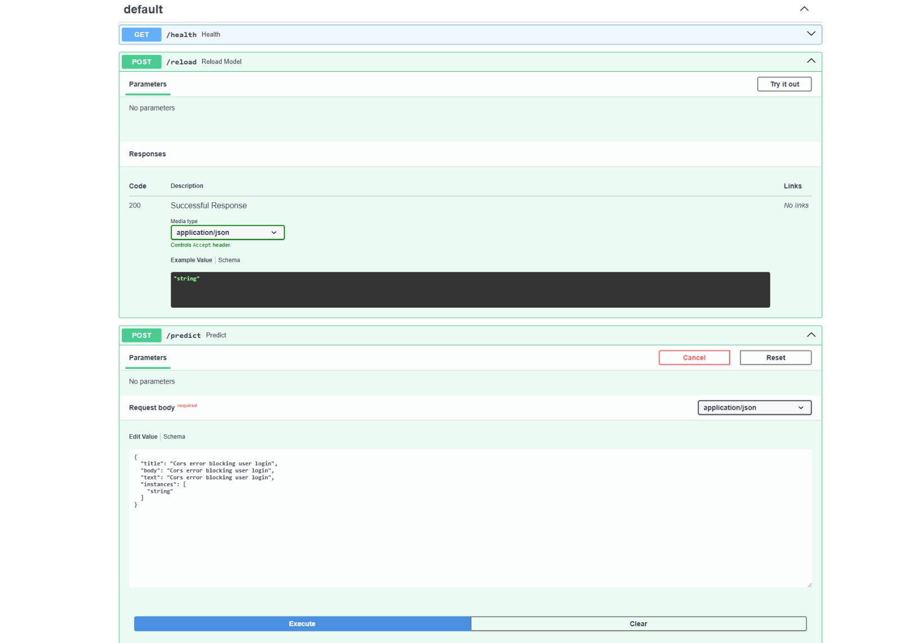

# Apéndice C — Microservicios de inferencia

Cada modelo se sirve como un microservicio de inferencia independiente construido con **FastAPI**,
contenerizado con **Docker** y protegido con validación de *token* JWT contra Keycloak (mismo
patrón de seguridad que los microservicios de negocio). El modelo entrenado viaja **dentro de la
imagen**, de modo que cada versión de imagen queda ligada a una versión exacta del modelo (MLOps
básico). Ambos exponen un *health check* en `/actuator/health` compatible con el balanceador.

## C.1 Servicio de clasificación — `issue-classifier-ms`

- **Puerto:** 8095 · **Stack:** FastAPI + scikit-learn + joblib.
- **Modelos:** dos *pipelines* de scikit-learn serializados (`modelo_tipo.joblib`,
  `modelo_severidad.joblib`), cargados una vez al arrancar.
- **Contrato:**

```
POST /v1/classify
Authorization: Bearer <token>
Request:  { "title": "App crashes on login", "body": "NullPointerException in AuthService..." }
Response: { "tipo": "bug", "severidad": "critica", "confianza_tipo": 0.8123 }
```

- `title` (1–500), `body` (opcional, ≤ 20 000). `confianza_tipo` es la probabilidad máxima del
  modelo de tipo (el modelo de severidad es SVM lineal, sin probabilidad).
- Códigos: `200` OK · `422` validación · `401` sin *token* / *token* inválido.

## C.2 Servicio de resumen — `commit-summarizer-ms`

- **Puerto:** 8096 · **Stack:** FastAPI + PyTorch (CPU).
- **Modelo:** *pointer-generator* seq2seq (checkpoint `.pt`), con el corpus de recuperación NNGen
  junto a los artefactos. Implementa la estrategia híbrida en cascada (ver Apéndice B, §B.3).
- **Contrato:**

```
POST /v1/summarize
Authorization: Bearer <token>
Request:  { "diff": "--- a/pom.xml\n+++ b/pom.xml\n@@ ...\n-  <version>0.6.1</version>\n+  <version>0.6.2</version>\n" }
Response: { "resumen": "bump version to 0.6.2" }
```

- `diff` (1–200 000 caracteres, salida de `git diff`). El servicio normaliza el diff al formato
  del corpus NNGen y poda diffs largos antes de la inferencia.

## C.3 Seguridad

Ambos servicios actúan como *OAuth2 Resource Server*: validan la firma RS256 del JWT contra el
JWKS del realm `Github` de Keycloak y verifican el emisor. El llamador (frontend) reenvía el
`Authorization: Bearer <token>` del usuario. Un *flag* de entorno permite desactivar la
autenticación en desarrollo local.

## C.4 Contenerización y publicación

- Imagen base `python:3.12-slim`, usuario no-root, `HEALTHCHECK` en `/actuator/health`.
- El resumidor reensambla en el `Dockerfile` el *checkpoint* dividido (GitHub no admite archivos
  mayores a 100 MB) y instala PyTorch desde el índice CPU.
- **CI/CD** (GitHub Actions): ante un cambio en la rama principal, ejecuta pruebas (`pytest`),
  construye la imagen y la publica en **Amazon ECR** (autenticación por OIDC, sin secretos
  guardados), y actualiza el servicio en ECS.

## C.5 Documentación de la API (Swagger)

FastAPI genera automáticamente la documentación OpenAPI/Swagger en `/docs` para ambos servicios.



*Figura C.1. Documentación Swagger de los servicios de IA. Fuente: elaboración propia, 2026.*
