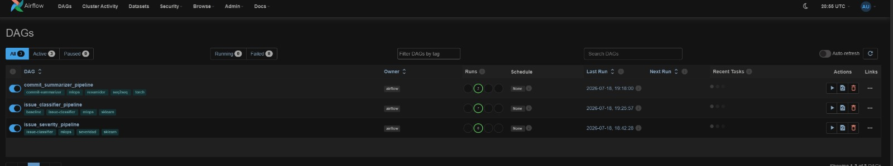
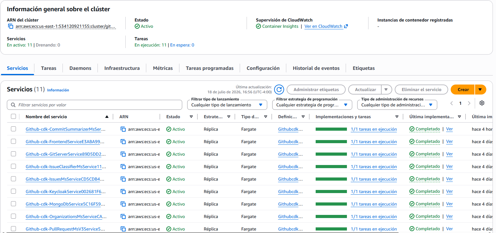

# Apéndice D — MLOps y despliegue

## D.1 Pipeline MLOps (Apache Airflow)

El ciclo de vida de los tres modelos (tipo, severidad y resumidor) se automatiza con un mismo
grafo de tareas de Airflow, generado por una **fábrica de DAG** parametrizable. El flujo es:

```
preprocess → train → evaluate → check_threshold (branch) → register_model / model_rejected → deploy_model (/reload)
```

- **Compuerta de calidad (*quality gate*).** Una tarea de ramificación lee `evaluation.json` y
  compara la métrica contra un umbral configurable por corrida: **F1-macro ≥ 0,60** (tipo),
  **≥ 0,40** (severidad), **BLEU-4 ≥ 5,0** (resumidor). Si no supera el umbral, ramifica a
  `model_rejected`; si lo supera, continúa.
- **Registro de modelos.** `register_model` copia el modelo y sus métricas a un registro
  versionado (`registry/<modelo>/vNNN_<ts>/`) con `metadata.json` y actualiza el puntero
  `latest.json` por modelo.
- **Despliegue en caliente (*hot-swap*).** `deploy_model` invoca `POST /reload` en la API
  correspondiente para recargar el modelo sin reiniciar el servicio.
- **Serving.** Tres APIs FastAPI sirven cada modelo desde el registro:

Tabla: APIs de serving del pipeline MLOps.

| Servicio | Puerto | Modelo |
|---|---|---|
| `model-api` | 8000 | Tipo (sklearn) |
| `model-api-severity` | 8001 | Severidad (sklearn) |
| `model-api-commit` | 8002 | Resumidor (torch) |

El pipeline completo se resume en la figura `fig_pipeline_mlops.png` (Capítulo 08).



*Figura D.1. DAG de Airflow en la interfaz. Fuente: elaboración propia, 2026.*

## D.2 Infraestructura en la nube (AWS CDK → ECS Fargate)

La plataforma completa se despliega con **AWS CDK** (TypeScript) sobre **ECS Fargate**. Un único
*stack* provisiona:

- **Red:** VPC con subredes públicas/privadas; **Service Discovery** (Cloud Map `github.local`).
- **Cómputo:** *cluster* ECS `github-ecs` con **once servicios** como tareas Fargate: frontend,
  keycloak, users, mongodb, git-server, repository, pull-request, organizations, issues y los
  **dos servicios de IA** (issue-classifier, commit-summarizer).
- **Datos:** RDS PostgreSQL gestionada (con una *Lambda* de inicialización de bases por servicio).
- **Exposición:** balanceadores **ALB** para frontend, keycloak, repository y un *shared-api* con
  un *listener* por servicio; los servicios de IA son internos (Cloud Map), consumidos por el
  frontend.
- **Imágenes:** los dos servicios de IA se publican desde **ECR**; el resto desde Docker Hub o
  *build* local (frontend, git-server).

El despliegue se ilustra en `fig_despliegue_ecs.png` (Capítulo 08).



*Figura D.2. Servicios en ejecución en ECS. Fuente: elaboración propia, 2026.*

## D.3 Integración y entrega continua (CI/CD)

Cada microservicio de IA incorpora un *workflow* de **GitHub Actions** que, ante un *push* a la
rama principal: (1) ejecuta las pruebas (`pytest`), (2) construye la imagen Docker, (3) se
autentica en AWS por **OIDC** (sin credenciales almacenadas), (4) publica la imagen en **ECR** con
etiquetas `sha` y `latest`, y (5) fuerza el redepliegue del servicio en ECS. Así, un cambio en el
modelo o el código llega a producción de forma reproducible y trazable.

## D.4 Limitaciones de la infraestructura

Orientada a entorno académico / *free-tier*: base de datos con retención de respaldos mínima,
recursos en subredes públicas y despliegue del *stack* de forma manual (`cdk deploy`); el pipeline
de CI/CD de la propia infraestructura es una mejora recomendada (Capítulo 11).
