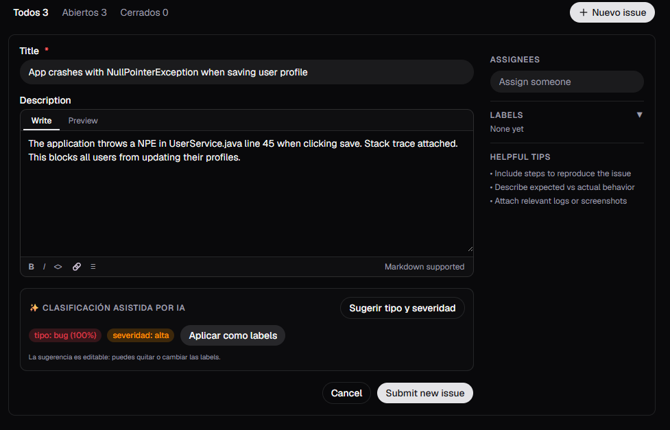
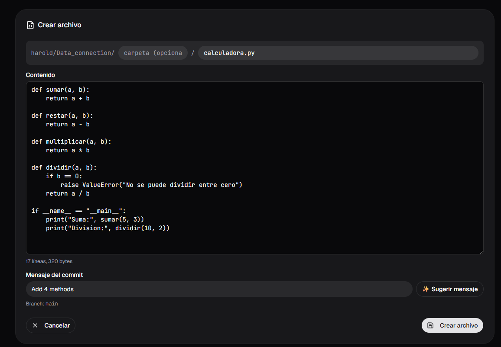
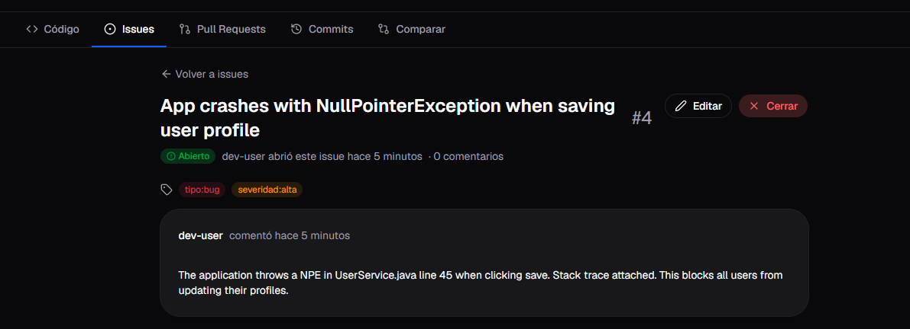

# Apéndice F — Evidencia de funcionamiento en producción

Este anexo documenta la validación de extremo a extremo del sistema desplegado en AWS
(evidencia 1B), ejecutando ambos modelos sobre *issues* y *commits* reales de la plataforma
Mini-GitHub en producción.

## F.1 Clasificación de issue asistida por IA

Al crear un *issue* real, el frontend invoca al clasificador y muestra el **tipo** y la
**severidad** sugeridos como *chips*; el usuario puede aplicarlos como *labels* editables.

*Figura F.1. Sugerencia de tipo y severidad al crear un issue en producción. Fuente: elaboración propia, 2026.*

## F.2 Resumen de commit asistido por IA

Al editar/crear un archivo, el resumidor propone el mensaje del *commit* a partir del cambio; el
campo se rellena automáticamente y el usuario puede ajustarlo antes de confirmar.

*Figura F.2. Mensaje de commit sugerido por el modelo en producción. Fuente: elaboración propia, 2026.*

## F.3 Issues con labels aplicadas por la sugerencia

La sugerencia del clasificador, una vez aplicada, se refleja en las *labels* `tipo:*` y
`severidad:*` de los *issues* del repositorio.

*Figura F.3. Issues con labels de tipo/severidad aplicadas. Fuente: elaboración propia, 2026.*

## F.4 Conclusión de la validación en producción

Las ejecuciones confirman el funcionamiento completo del sistema (frontend → servicios de IA →
persistencia) con datos reales de la plataforma: los modelos responden, sus sugerencias se
presentan de forma editable y se integran en el flujo de trabajo del desarrollador. Esto valida,
más allá de las métricas de laboratorio (Capítulo 09), la operatividad de la solución desplegada.
