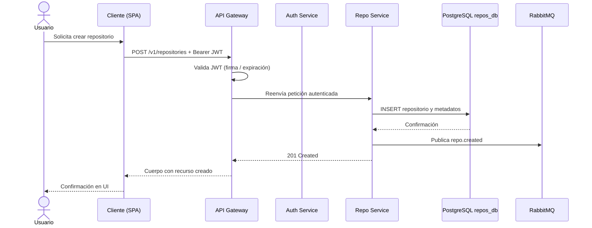
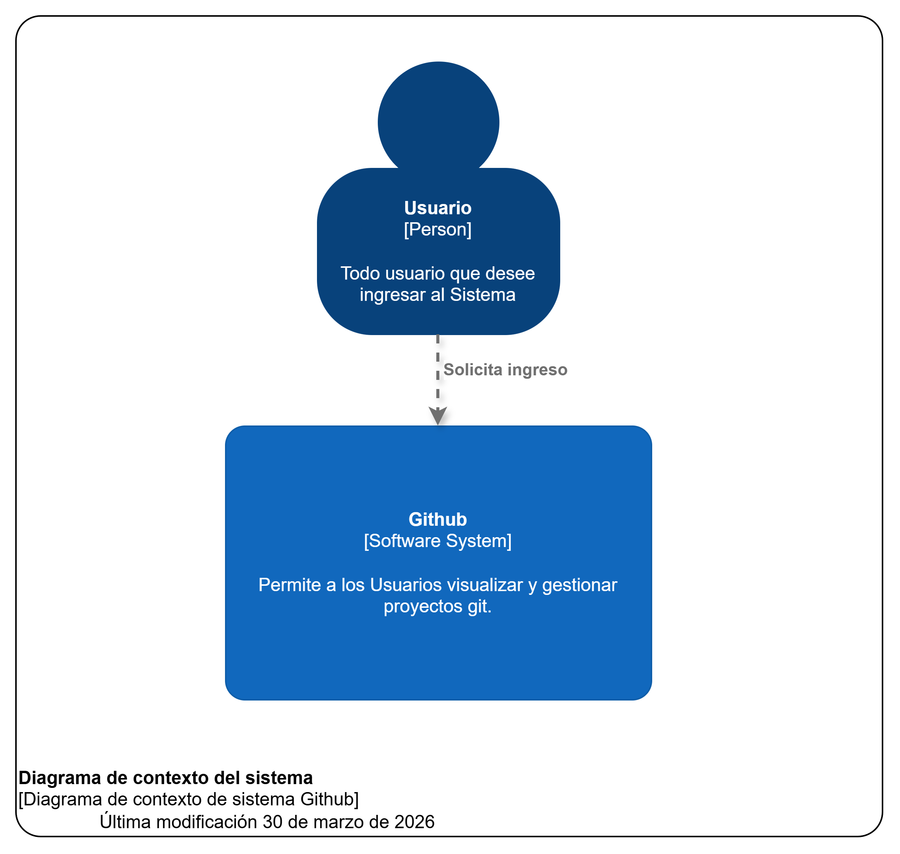
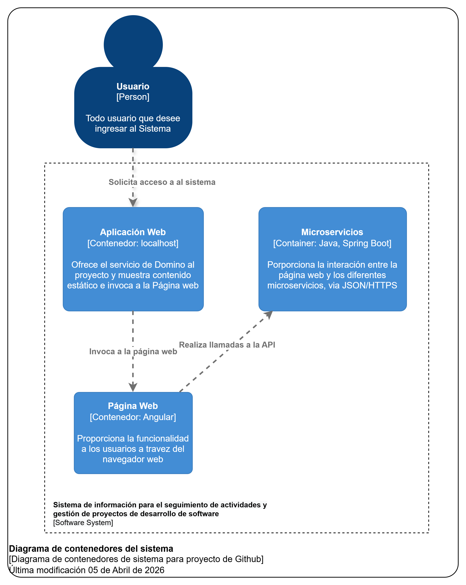
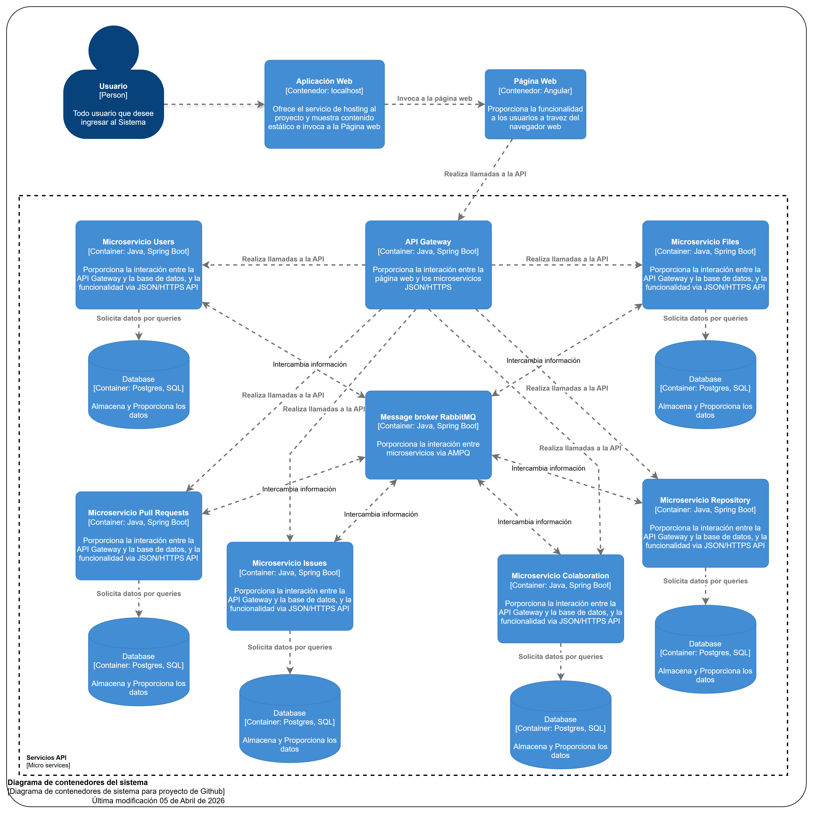
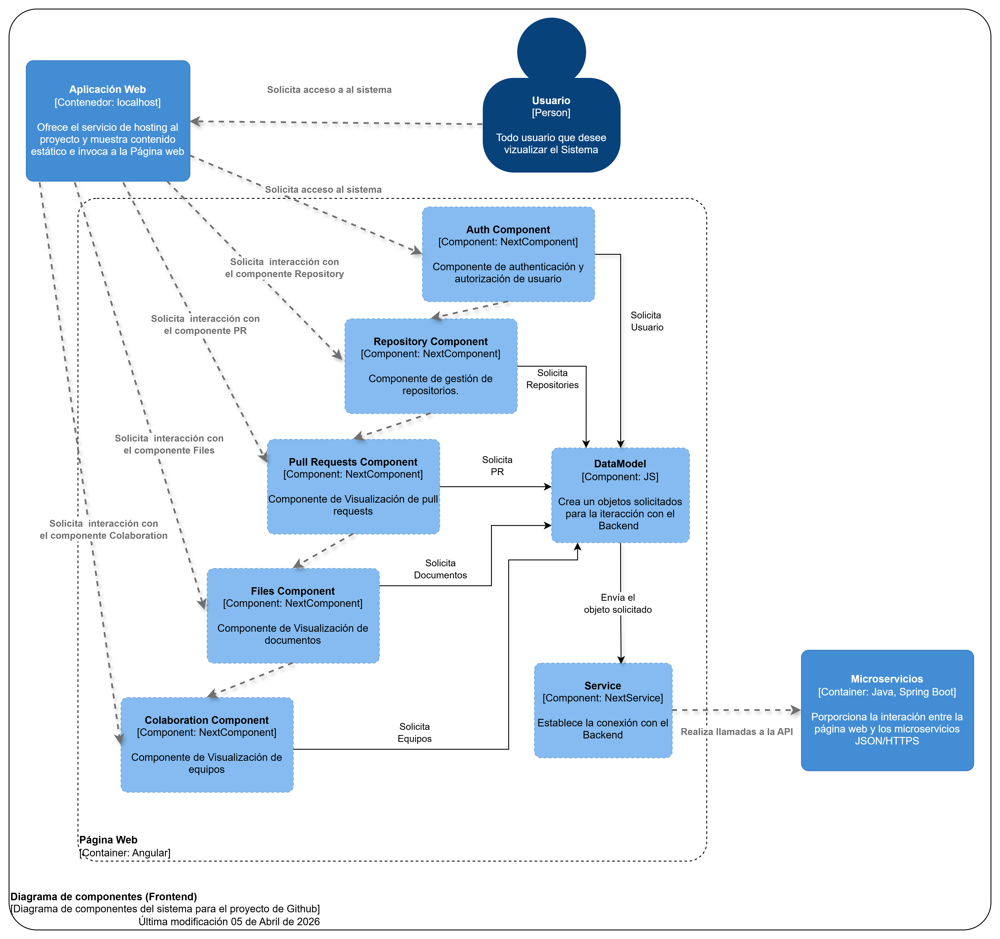
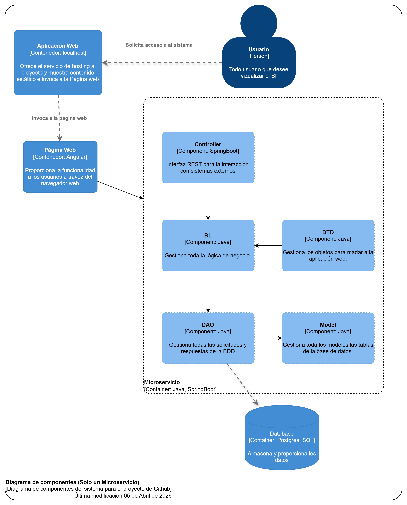
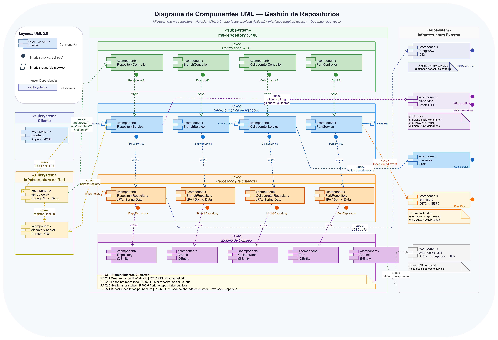
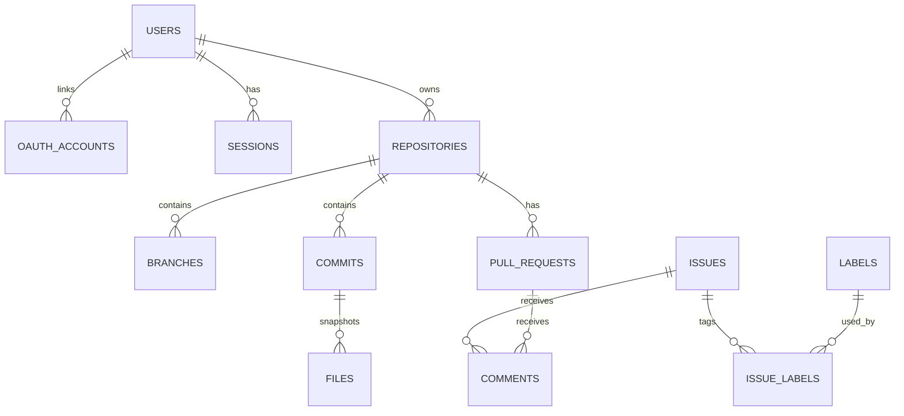
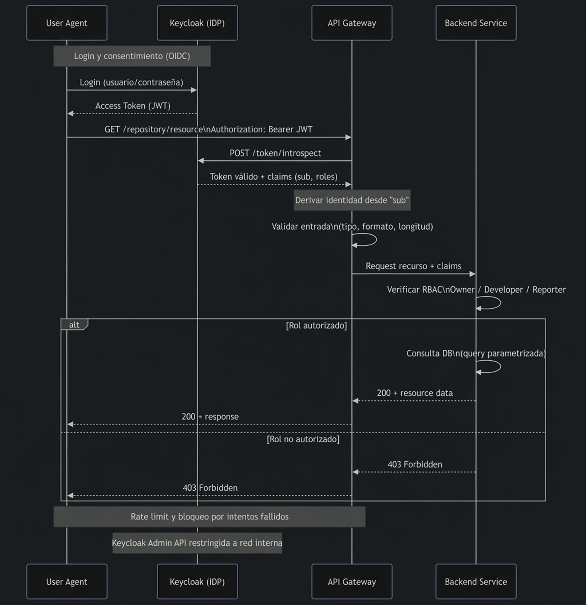
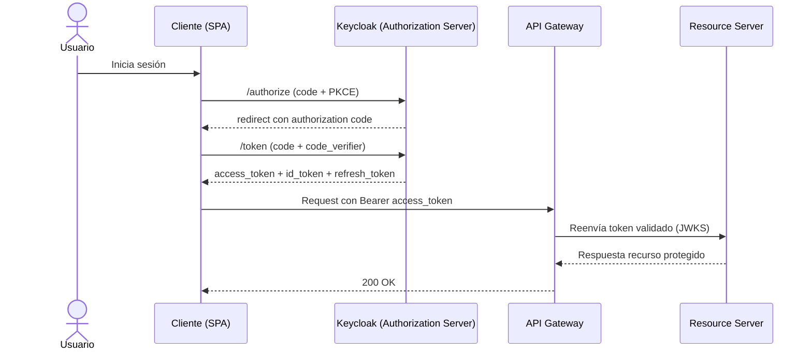

# GitHub — Documento de diseño técnico

**Estado del documento:** EN REVISIÓN

---

## Resumen

GitHub es un proyecto académico que implementa una forja de código simplificada con arquitectura de microservicios. El sistema permite autenticación (local y OIDC con Keycloak), gestión de repositorios, operaciones Git básicas por HTTPS (sin SSH), issues, pull requests en flujo básico y búsqueda. La solución se documenta a partir de un contrato API en Smithy/OpenAPI y se despliega en entorno cloud/local con PostgreSQL por servicio, almacenamiento de objetos y mensajería asíncrona.

Nuestros clientes son principalmente estudiantes, docentes y evaluadores que usan la demo para validar capacidades técnicas del equipo. El valor que entregamos es una plataforma entendible, desplegable y demostrable en tiempos académicos, con foco en seguridad básica, trazabilidad y alcance realista (sin funcionalidades enterprise como CI/CD integrado, notificaciones y reglas avanzadas de protección de ramas).

---

## Supuestos

1. Se asume la disponibilidad de un proveedor **cloud** (p. ej. AWS) con permisos suficientes para desplegar EKS, RDS y recursos de red asociados, o bien un entorno local equivalente (p. ej. Docker Compose) para desarrollo.
2. Se asume que **Keycloak** queda operativo —ya sea mediante el stack CDK de referencia o un despliegue equivalente— con _realm_ y clientes configurados para el flujo OIDC descrito en este documento.
3. Se asume que el equipo dispone del repositorio **Github-Smithy** compilable (`./gradlew build`, `./gradlew smithyBuild`) para obtener el artefacto OpenAPI canónico.
4. Se asume que el proyecto se desarrollará en un plazo máximo de **4 semanas**.
5. Se asume un equipo de hasta **4 integrantes** con disponibilidad suficiente para sostener el marco de trabajo ágil acordado.

---

## Alcance y fases

La Fase 1 incluye:

- Diseño técnico del sistema y definición de arquitectura de microservicios.
- Configuración de autenticación y autorización (AuthN/AuthZ) con Keycloak y OIDC.
- Definición y validación del contrato API en Smithy/OpenAPI.
- Base de infraestructura para entorno de desarrollo y despliegue inicial.

La Fase 2 incluye:

- Implementación de microservicios principales (Auth, Repo, Issue, Search).
- Persistencia en PostgreSQL por servicio, almacenamiento de archivos y mensajería asíncrona.
- Funcionalidades de producto: repositorios, archivos, issues, pull requests básicos, búsqueda y colaboración.
- Endpoints documentados en Swagger y validación funcional integrada.

La Entrega final incluye:

- Despliegue funcional en cloud y validación operativa.
- Observabilidad básica (health checks y logging).
- Evidencia de automatización externa del proyecto del equipo (sin CI/CD como feature del producto).
- Presentación final y demo grabada.

Fuera del alcance:

- CI/CD como funcionalidad del producto GitHub (L-01).
- Funcionalidades enterprise del servidor Git (HA/replicación/hardening avanzado).
- Acceso por SSH y gestión de claves públicas (solo HTTPS para operaciones Git).
- Organizaciones complejas y permisos empresariales avanzados.
- Registro de paquetes, Git LFS y búsqueda full-text dentro del contenido de archivos.
- Notificaciones por correo o en tiempo real (WebSockets/SSE/push).

---

## 1. Requerimientos

### 1.1 Requerimientos Funcionales

1. **RF-P1 (Alta).** Los usuarios registrados deben poder **autenticarse** mediante correo y contraseña o, alternativamente, mediante **OIDC/SSO** con Keycloak (incluida federación con proveedores externos configurados en el _realm_), **para** acceder a recursos protegidos sin depender de un único mecanismo de credenciales.

2. **RF-P2 (Alta).** Los usuarios autenticados deben poder **crear y administrar repositorios** (visibilidad pública o privada), **subir y recuperar archivos** asociados y consultar la estructura lógica de ramas según el modelo académico, **para** versionar y compartir artefactos de software dentro de los límites del proyecto.

3. **RF-P3 (Media).** Los colaboradores autorizados deben poder **gestionar issues y pull requests en flujo básico** (creación, comentarios, revisión y merge simplificado), **para** coordinar cambios sin implementar el ecosistema completo de revisiones de GitHub.

### 1.2 Requerimientos no funcionales

| ID         | Enunciado                                                                                                                         | Métrica o criterio de verificación                                                                                   | Dimensión                                                     |
| ---------- | --------------------------------------------------------------------------------------------------------------------------------- | -------------------------------------------------------------------------------------------------------------------- | ------------------------------------------------------------- |
| **RNF-P1** | El sistema debe implementar **arquitectura de microservicios** con al menos cuatro servicios desplegables de forma independiente. | Cuatro o más contenedores/servicios con health check operativo en compose o K8s.                                     | Escalabilidad / modularidad                                   |
| **RNF-P2** | El API Gateway debe ofrecer latencia razonable bajo carga académica.                                                              | p95 de latencia en rutas críticas **inferior a 200 ms** en pruebas con ~100 usuarios concurrentes simulados.         | Latencia                                                      |
| **RNF-P3** | Las comunicaciones externas deben emplear **HTTPS (TLS 1.3)** y los secretos no deben almacenarse en código fuente.               | Endpoints públicos solo TLS; variables sensibles inyectadas por entorno o secretos de K8s.                           | Seguridad                                                     |
| **RNF-P4** | Cada microservicio debe persistir en **su propia base PostgreSQL** (patrón _database per service_).                               | Tres instancias lógicas mínimas (`auth_db`, `repos_db`, `issues_db`) sin esquema compartido accidental.              | Consistencia de diseño / CAP (servicios débilmente acoplados) |
| **RNF-P5** | El contrato REST debe permanecer **versionado y generado desde Smithy**, con documentación **OpenAPI/Swagger** accesible.         | Artefacto `MiniGitHubApi.openapi.json` reproducible por build; UI en `/api-docs` o equivalente por servicio/gateway. | Mantenibilidad                                                |

### 1.3 Estimación de capacidad

Para el alcance académico, se adopta el orden de magnitud ya consensuado en la documentación general: aproximadamente **100 usuarios concurrentes**, almacenamiento total del orden de **gigabytes** en tier gratuito o de demostración, y tráfico de búsqueda dominado por lecturas. Por tanto, no se justifica particionamiento agresivo en la fase inicial; no obstante, el Search Service y Elasticsearch permiten evolucionar hacia mayor volumen si el proyecto lo requiere.

---

## 2. Entidades principales

El modelo conceptual se alinea con `EntidadesPrincipales.md` y el esquema relacional consolidado en `ModeloDeDatos.md`. A continuación se sintetizan los agregados más relevantes y su pertenencia por servicio.

| Entidad (agregado)                                                                   | Servicio propietario | Persistencia                                  | Relación destacada                                                |
| ------------------------------------------------------------------------------------ | -------------------- | --------------------------------------------- | ----------------------------------------------------------------- |
| **User**, **OAuthAccount**, **Session**                                              | Auth                 | PostgreSQL `auth_db`                          | Un usuario posee cero o más cuentas OAuth                         |
| **Repository**, **RepositoryPermission**, **Branch**, **Commit**, **File**, **Star** | Repo                 | PostgreSQL `repos_db` (+ objetos en MinIO/S3) | Repositorio pertenece a un propietario; permisos N:M usuario–repo |
| **Issue**, **Label**, **IssueLabel**, **Comment**, **PullRequest**                   | Issue                | PostgreSQL `issues_db`                        | Issues y PR vinculados al identificador lógico del repositorio    |
| **Índices de búsqueda** (proyección)                                                 | Search               | Elasticsearch                                 | Materialización eventual a partir de eventos de dominio           |

- Un Usuario puede poseer muchos Repositorios y tener múltiples Sesiones activas.

- Un Repositorio contiene múltiples Branches, Commits, e Issues.

- Los Pull Requests conectan dos Branches para proponer cambios.

- Los Comentarios se centralizan en la discusión de Issues y Pull Requests.

- Las Etiquetas (Labels) se vinculan de forma muchos-a-muchos con las Issues para facilitar la filtración.

En este sentido, la separación por servicio permite evolucionar el esquema de issues sin migrar la base de autenticación, a la vez que impone el uso de **identificadores UUID** compartidos como referencias lógicas entre contextos acotados.

---

## 3. API o Interfaz del Sistema

Para una referencia detallada se tiene los APIs en el siguiente [recurso](../APIS_RESUMEN.md)

### 3.1 Protocolo y contrato

Se adopta **REST** sobre JSON con autenticación **Bearer JWT**, conforme al servicio Smithy `com.minigithub#MiniGitHubApi` (`@httpBearerAuth`). El listado de operaciones agregadas en `model/service.smithy` agrupa los casos de uso por puertos lógicos de referencia: **3001** (auth), **3002** (repositorio y archivos), **3003** (issues y pull requests), **3004** (búsqueda).

Convención de versionado: la interfaz pública canónica se publica bajo prefijo **`/v1`**.

### 3.2 Operaciones representativas

Este documento resume solo las operaciones críticas. El inventario completo de endpoints públicos se mantiene en `README.md` (sección **API Endpoints**) y el contrato canónico permanece en Smithy/OpenAPI.

**APIs públicas (REST) prioritarias**

| Operación          | Método y ruta                                                      | Entrada (request)                                | Salida (response)                          | Excepciones HTTP                         | Restricciones clave                                             |
| ------------------ | ------------------------------------------------------------------ | ------------------------------------------------ | ------------------------------------------ | ---------------------------------------- | --------------------------------------------------------------- |
| Register           | `POST /v1/users`                                                   | `username`, `email`, `password` (requeridos)     | `user`, `accessToken`, `refreshToken`      | `400`, `409`, `422`                      | `email` válido; contraseña con política mínima                  |
| Login              | `POST /v1/sessions`                                                | `email`, `password` (requeridos)                 | `accessToken`, `refreshToken`, `expiresIn` | `400`, `401`, `429`                      | bloqueo temporal por intentos fallidos                          |
| CreateRepository   | `POST /v1/repositories`                                            | `name` (requerido), `description?`, `visibility` | metadatos del repositorio creado           | `400`, `401`, `403`, `409`               | `name` único por propietario; `visibility` en {public, private} |
| GetFileContent     | `GET /v1/repositories/{owner}/{repo}/contents/{path}`              | `owner`, `repo`, `path` (ruta); `ref?` (query)   | contenido, `sha`, metadatos                | `400`, `401`, `403`, `404`               | `path` obligatorio y normalizado                                |
| CreateIssue        | `POST /v1/repositories/{owner}/{repo}/issues`                      | `title` (requerido), `body?`, `labels?`          | issue creado con `id` y `number`           | `400`, `401`, `403`, `404`, `422`        | `title` no vacío; labels válidos en el repo                     |
| CreatePullRequest  | `POST /v1/repositories/{owner}/{repo}/pull-requests`               | `title`, `base`, `head` (requeridos), `body?`    | PR creado (`id`, `status`)                 | `400`, `401`, `403`, `404`, `409`        | no se permite PR si `base == head`                              |
| MergePullRequest   | `POST /v1/repositories/{owner}/{repo}/pull-requests/{prId}/merges` | `prId` (ruta), `commitMessage?`                  | estado final de PR (`merged`)              | `400`, `401`, `403`, `404`, `409`, `422` | solo PR abierto y mergeable                                     |
| SearchRepositories | `GET /v1/search/repositories?q={texto}`                            | `q` (requerido), `page?`, `limit?`               | lista paginada de repositorios             | `400`, `401`, `422`                      | `limit` acotado (p. ej. max 100)                                |

**Tipos de datos complejos**

- `Repository`: `id`, `owner`, `name`, `visibility`, `defaultBranch`, `createdAt`.
- `Issue`: `id`, `number`, `title`, `body`, `state`, `labels[]`, `authorId`.
- `PullRequest`: `id`, `title`, `base`, `head`, `status`, `authorId`, `mergedAt?`.

### 3.3 APIs internas y eventos

Las APIs internas son asíncronas mediante eventos en **RabbitMQ**, para desacoplar escritura transaccional e indexación/búsqueda.

| Evento interno  | Productor     | Consumidor principal       | Payload mínimo                                        |
| --------------- | ------------- | -------------------------- | ----------------------------------------------------- |
| `repo.created`  | Repo Service  | Search Service             | `repoId`, `owner`, `name`, `visibility`, `timestamp`  |
| `repo.updated`  | Repo Service  | Search Service             | `repoId`, campos modificados, `timestamp`             |
| `issue.created` | Issue Service | Search Service             | `issueId`, `repoId`, `title`, `authorId`, `timestamp` |
| `pr.merged`     | Issue Service | Search Service / Analytics | `prId`, `repoId`, `mergedBy`, `timestamp`             |

Regla de consistencia: estas proyecciones son eventualmente consistentes; el estado fuente de verdad permanece en las bases transaccionales de cada servicio.

### 3.4 Validación y seguridad de entrada

Las entradas se validan en el borde (gateway/controlador) contra el esquema derivado del contrato, con controles explícitos de seguridad:

- El usuario autenticado se deriva siempre del token Bearer (`sub`); no se acepta `userId` de confianza en el body para autorización.
- Validación de tipos, longitudes y formato para todos los campos requeridos y opcionales.
- Normalización de rutas (`path`) y rechazo de traversal (`..`) para operaciones de archivos.
- Sanitización/escape de cadenas mostrables en UI para reducir XSS persistente o reflejado.
- Parametrización de consultas y prohibición de SQL dinámico concatenado para prevenir inyección SQL.
- Códigos de error consistentes (`400`, `401`, `403`, `404`, `409`, `422`) y cuerpo de error uniforme (`code`, `message`, `details?`).

### 3.5 Ejemplos de contrato

**Ejemplo A - API pública (REST): crear repositorio**

Operación: `CreateRepository`

```http
POST /v1/repositories
Authorization: Bearer <access_token>
Content-Type: application/json

{
    "name": "github-demo",
    "description": "Repositorio de prueba",
    "visibility": "private"
}
```

Respuesta exitosa (`201 Created`):

```json
{
  "id": "a3f4d2c1-8a0e-4d12-a5cc-5f66b8d28b90",
  "owner": "jdoe",
  "name": "github-demo",
  "visibility": "private",
  "defaultBranch": "main",
  "createdAt": "2026-04-05T10:30:00Z"
}
```

Errores y códigos:

- `400 Bad Request`: payload inválido (tipo/formato incorrecto).
- `401 Unauthorized`: token ausente, expirado o inválido.
- `409 Conflict`: nombre de repositorio duplicado para el propietario.
- `422 Unprocessable Entity`: regla de negocio incumplida.

Restricciones:

- Requeridos: `name`, `visibility`.
- Opcional: `description`.
- `owner` y `authorId` no se reciben en body; se derivan del token (`sub`).
- `name` solo acepta caracteres permitidos por política (sin `;`, sin control chars).

**Ejemplo B - API pública (REST): crear pull request**

Operación: `CreatePullRequest`

```http
POST /v1/repositories/{owner}/{repo}/pull-requests
Authorization: Bearer <access_token>
Content-Type: application/json

{
    "title": "Feature auth improvements",
    "base": "main",
    "head": "feature/auth-improvements",
    "body": "Resumen de cambios"
}
```

Respuesta exitosa (`201 Created`):

```json
{
  "id": "7f90f8c1-b8d7-4ebc-98c9-3c3ea1dd04cc",
  "number": 12,
  "status": "open",
  "base": "main",
  "head": "feature/auth-improvements",
  "authorId": "f94a66d0-6b66-4a1f-8f2e-c8d2c64a2605"
}
```

Errores y códigos:

- `400 Bad Request`: campos requeridos faltantes.
- `403 Forbidden`: sin permisos de escritura en el repositorio.
- `404 Not Found`: repositorio o rama inexistente.
- `409 Conflict`: `base` y `head` iguales o PR ya existente para el mismo par.

Tipos de datos complejos involucrados:

- `PullRequest`: `id`, `number`, `status`, `base`, `head`, `authorId`, `mergedAt?`.
- `ApiError`: `code`, `message`, `details?`, `traceId`.

**Ejemplo C - API interna (evento): indexación de búsqueda**

Operación interna: publicación de evento `repo.created` (RabbitMQ)

```json
{
  "event": "repo.created",
  "repoId": "a3f4d2c1-8a0e-4d12-a5cc-5f66b8d28b90",
  "owner": "jdoe",
  "name": "github-demo",
  "visibility": "private",
  "timestamp": "2026-04-05T10:30:01Z"
}
```

Resultado esperado: Search Service consume el evento y actualiza proyección en Elasticsearch (consistencia eventual).

---

## 4. Flujo de datos

El diagrama siguiente resume el camino desde el cliente hasta la persistencia y la emisión de evento.



### 4.2 Flujo de indexación

Cuando el Search Service consume `repo.created`, actualiza el índice en Elasticsearch. Por tanto, la consistencia entre lectura en búsqueda y escritura en Repo es **eventual**, coherente con un patrón CQRS ligero.

---

## 5. Diseño de alto nivel

### 5.1 Componentes y comunicaciones

### 5.1 Modelos C4

#### Diagrama de contexto



#### Diagrama de contenedores





#### Diagrama de componentes





### 5.2 Componentes y comunicaciones



Este diagrama resume la topología documentada en `README.md` de github-docs. Además, conecta el rol de **Keycloak** como proveedor OIDC externo a los microservicios.

### 5.2 Diagramas de Secuencia - Gestión de Repositorios

A continuación se presentan los diagramas de secuencia detallados para las operaciones principales de gestión de repositorios, mostrando la interacción entre componentes del sistema.

#### 5.2.1 Crear Repositorio Nuevo

Este diagrama ilustra el flujo completo desde que un usuario autenticado solicita crear un repositorio hasta que el sistema persiste los datos y retorna la confirmación.


**Flujo del proceso:**

1. **Autenticación:** El usuario envía la petición con JWT token en el header Authorization
2. **Validación de permisos:** El API Gateway valida el token con el Auth Service
3. **Validación de negocio:** El Repo Service verifica que el nombre del repositorio sea único para ese usuario
4. **Persistencia:** Se crea el repositorio en PostgreSQL con sus metadatos (nombre, descripción, visibilidad)
5. **Inicialización:** Se crea la rama `main` por defecto y un archivo README.md inicial en MinIO
6. **Eventos:** Se publica evento `repo.created` a RabbitMQ para notificar al Search Service
7. **Respuesta:** Se retorna código HTTP 201 con los datos del repositorio creado

**Validaciones clave:**
- Nombre de repositorio debe ser único por propietario
- Formato del nombre: alfanumérico, guiones, 1-100 caracteres
- Usuario debe estar autenticado (token JWT válido)

**Manejo de errores:**
- `409 Conflict`: Si ya existe un repositorio con ese nombre para el usuario
- `400 Bad Request`: Si el formato del nombre es inválido
- `401 Unauthorized`: Si el token JWT es inválido o ha expirado

#### 5.2.2 Listar Repositorios de Usuario

Este diagrama muestra cómo el sistema recupera y presenta la lista de repositorios asociados a un usuario específico.


**Flujo del proceso:**

1. **Solicitud:** El cliente solicita `GET /v1/repositories?owner={username}` con paginación
2. **Autenticación:** Gateway valida JWT y extrae identidad del usuario
3. **Consulta:** Repo Service consulta PostgreSQL filtrando por `owner_id`
4. **Filtrado de visibilidad:**
   - Si el usuario es el propietario: retorna repositorios públicos y privados
   - Si es otro usuario: retorna solo repositorios públicos
5. **Enriquecimiento:** Se agregan datos calculados (estrellas, forks, último commit)
6. **Paginación:** Se aplica `limit` y `offset` (default: 30 repos por página)
7. **Respuesta:** Se retorna lista con metadata de paginación (total_count, page, per_page)

**Parámetros de consulta:**
- `owner`: Nombre de usuario (requerido)
- `visibility`: Filtro opcional (`public`, `private`, `all`)
- `sort`: Ordenamiento (`created`, `updated`, `name`, `stars`)
- `page`: Número de página (default: 1)
- `per_page`: Cantidad por página (default: 30, max: 100)

**Optimizaciones:**
- Índice compuesto en `(owner_id, created_at DESC)` para ordenamiento eficiente
- Cache de resultados en Redis por 5 minutos para usuarios con muchos repositorios
- Carga eager de relaciones frecuentes (owner, default_branch)

#### 5.2.3 Editar Información de Repositorio

Este diagrama detalla el proceso de actualización de metadatos de un repositorio existente.


**Flujo del proceso:**

1. **Solicitud:** Cliente envía `PATCH /v1/repositories/{owner}/{repo}` con campos a actualizar
2. **Autenticación y Autorización:**
   - Gateway valida JWT
   - Repo Service verifica que el usuario tenga rol `Owner` en el repositorio
3. **Validación de datos:**
   - Nuevo nombre (si aplica) no debe estar en uso por el mismo propietario
   - Descripción no excede 500 caracteres
   - Visibilidad es `public` o `private`
4. **Actualización:** Se modifican solo los campos enviados (partial update)
5. **Evento:** Se publica `repo.updated` con campos modificados para reindexación
6. **Respuesta:** Se retorna código HTTP 200 con el repositorio actualizado

**Campos editables:**
- `name`: Nombre del repositorio (requiere verificación de unicidad)
- `description`: Descripción textual (max 500 caracteres)
- `visibility`: `public` o `private`
- `default_branch`: Rama por defecto (debe existir)
- `homepage`: URL del sitio web del proyecto
- `topics`: Array de tags para categorización

**Restricciones de autorización:**
- Solo el `Owner` puede editar estos campos
- `Developer` puede modificar solo algunos metadatos (topics, homepage)
- `Reporter` no tiene permisos de edición

**Casos especiales:**
- Cambio de nombre actualiza URLs en respuestas subsecuentes
- Cambio de visibilidad a `private` revoca acceso a no-colaboradores
- Cambio de `default_branch` valida que la rama exista

#### 5.2.4 Eliminar Repositorio

Este diagrama muestra el proceso de eliminación permanente de un repositorio y todos sus recursos asociados.


**Flujo del proceso:**

1. **Solicitud:** Cliente envía `DELETE /v1/repositories/{owner}/{repo}`
2. **Autenticación y Autorización:**
   - Gateway valida JWT
   - Repo Service verifica rol `Owner` (solo el propietario puede eliminar)
3. **Confirmación (opcional):** Si está configurado, requiere confirmación explícita con el nombre del repositorio en el body
4. **Eliminación en cascada:**
   - **Paso 1:** Se eliminan archivos del bucket MinIO `repos/{repo_id}/*`
   - **Paso 2:** Se eliminan registros relacionados en PostgreSQL:
     - `commits` (con archivos asociados en `commit_files`)
     - `branches`
     - `files`
     - `stars`
     - `collaborators` (permisos)
   - **Paso 3:** Se elimina el registro del repositorio (dispara cascade por FK)
5. **Limpieza de índices:** Se publica evento `repo.deleted` para remover de Elasticsearch
6. **Respuesta:** Se retorna código HTTP 204 No Content

**Validaciones previas a eliminación:**
- Usuario debe tener rol `Owner`
- Confirmación con nombre exacto del repositorio (previene eliminaciones accidentales)
- Opcionalmente: verificar que no haya PRs abiertos desde forks

**Proceso de eliminación (transaccional):**

```sql
BEGIN TRANSACTION;
-- 1. Eliminar relaciones N:M
DELETE FROM stars WHERE repo_id = ?;
DELETE FROM collaborators WHERE repo_id = ?;
-- 2. Eliminar entidades dependientes
DELETE FROM commit_files WHERE commit_id IN (SELECT id FROM commits WHERE repo_id = ?);
DELETE FROM files WHERE repo_id = ?;
DELETE FROM commits WHERE repo_id = ?;
DELETE FROM branches WHERE repo_id = ?;
-- 3. Eliminar repositorio (dispara cascade restante)
DELETE FROM repositories WHERE id = ?;
COMMIT;
```

**Manejo de archivos en MinIO:**
- Eliminación de bucket completo: `DELETE /repos/{repo_id}`
- Si falla MinIO: Se marca repositorio como `deleted` y se programa limpieza asíncrona
- Rollback PostgreSQL si eliminación de archivos falla

**Consideraciones de seguridad:**
- Eliminación es **permanente e irreversible** (no hay papelera de reciclaje)
- Logs de auditoría registran quién eliminó qué y cuándo
- Opción de "archivar" en lugar de eliminar (soft delete) para casos especiales

**Eventos publicados:**
- `repo.deleted`: Payload con `repo_id`, `owner_id`, `name`, `timestamp`
- Consumidores: Search Service (remover índice), Analytics Service (métricas)

### 5.3 Infraestructura AWS (referencia Github-Cdk)

El stack `KeycloakStack` compone **GithubVpc**, **KubeCluster** (EKS), **GithubDatabase** (RDS PostgreSQL) y **KeycloakManifests**. En consecuencia, la identidad del despliegue académico puede anclarse a un entorno Kubernetes gestionado en AWS, si bien los microservicios de negocio pueden desplegarse en fases posteriores sobre el mismo clúster o en compose local.

[Repo CDK](https://github.com/Savitar465/Github-Cdk.git)

---

## 6. Inmersiones profundas

### 6.1 Esquema de base de datos

La fuente de verdad del esquema relacional se mantiene en [ModeloDeDatos.md](../ModeloDeDatos.md). Esta seccion resume los cambios de esquema relevantes para el diseno y su impacto de compatibilidad.

**Cambios de esquema aplicados**

- Estandarizacion de identificadores a `UUID` en entidades principales.
- Consolidacion del patron `database-per-service` con `auth_db`, `repos_db` e `issues_db`.
- Uso de `repo_id` como referencia logica en `issues` y `labels` (sin FK fisica cross-service) para mantener bajo acoplamiento entre servicios.
- Restriccion de integridad en `comments` para asegurar destino unico (`issue_id` o `pull_request_id`, no ambos).

**Compatibilidad hacia atras**

- Se recomienda estrategia `expand -> migrate -> contract` para cambios de esquema:
  - `expand`: agregar nuevas columnas, constraints e indices sin romper clientes actuales.
  - `migrate`: poblar datos y ajustar servicios consumidores/proveedores.
  - `contract`: retirar columnas o rutas legacy una vez validadas.
- En integraciones activas, mantener alias de API legacy temporales (si aplica) y traduccion de payload en gateway.

**Actividad de migracion de datos**

- Normalizacion de ids antiguos al formato `UUID` cuando corresponda.
- Backfill de datos para restricciones nuevas (por ejemplo, estado de PR y numeracion de issues por repositorio).
- Validacion de consistencia de `repo_id` via Repo Service antes de escritura en Issue Service.
- Ejecucion de migraciones en ventanas controladas, con backup previo y validacion post-migracion.

**Referencias de implementacion**

- Esquema SQL base: [ModeloDeDatos.md](../ModeloDeDatos.md)
- Entidades y relaciones de dominio: [EntidadesPrincipales.md](../EntidadesPrincipales.md)
- Repositorios del ecosistema: [Repositorios.md](../Repositorios.md)

**Tabla simple de entidades críticas**

| Tabla           | Columnas clave                                   | Tipos                        | Restricciones clave              | Descripción                            |
| --------------- | ------------------------------------------------ | ---------------------------- | -------------------------------- | -------------------------------------- |
| `users`         | `id`, `email`, `username`                        | UUID, VARCHAR                | PK, UNIQUE                       | Identidad base de usuarios             |
| `repositories`  | `id`, `owner_id`, `name`                         | UUID, UUID, VARCHAR          | PK, FK, UNIQUE por propietario   | Repositorios del dominio principal     |
| `issues`        | `id`, `repo_id`, `number`, `state`               | UUID, UUID, INTEGER, VARCHAR | PK, UNIQUE (`repo_id`, `number`) | Seguimiento de trabajo por repositorio |
| `pull_requests` | `id`, `repository_id`, `status`                  | UUID, UUID, VARCHAR          | PK, FK, CHECK de estado          | Flujo de PR basico entre ramas         |
| `labels`        | `id`, `repo_id`, `name`                          | UUID, UUID, VARCHAR          | PK, UNIQUE (`repo_id`, `name`)   | Etiquetas por repositorio              |
| `issue_labels`  | `issue_id`, `label_id`                           | UUID, UUID                   | PK compuesta, FKs                | Relacion muchos-a-muchos issue-label   |
| `comments`      | `id`, `issue_id`, `pull_request_id`, `author_id` | UUID, UUID, UUID, UUID       | PK, CHECK de exclusión mutua     | Comentarios sobre issues o PR          |

**Fuente de diagrama ER (Mermaid)**



### 6.2 Escalabilidad e infraestructura

El diseño se apoya en servicios stateless detrás de API Gateway, con escalado horizontal en capa de aplicación y escalado vertical controlado en datos.

**Estrategia de escalado**

- Escalado horizontal: API Gateway, Auth, Repo, Issue y Search con réplicas según carga (RNF11).
- Escalado vertical inicial: PostgreSQL por servicio (`db.t3.micro` en referencia académica) con posibilidad de subir clase de instancia antes de particionar.
- Escalado por desacople: RabbitMQ absorbe picos y permite que indexación en Search no bloquee transacciones críticas.

**Cuellos de botella y mitigaciones**

- Base de datos: riesgo en picos de escritura. Mitigación: índices en columnas de filtro frecuentes, pooling y paginación obligatoria.
- Búsqueda: latencia por reindexado. Mitigación: consumo asíncrono por lotes y control de `limit` en API de búsqueda.
- Almacenamiento de objetos: latencia en archivos grandes. Mitigación: límites de tamaño y flujo por streaming.

**Capacidad objetivo (alineada con docs)**

- Concurrencia mínima objetivo: **100 usuarios concurrentes**.
- Objetivo de latencia gateway: p95 < **100-200 ms** según entorno de prueba (RNF10 y ajuste académico de esta entrega).
- Patrón de tráfico esperado: predominio de lecturas (búsqueda y consultas de repositorio) sobre escrituras.

**Estimación de costo mensual (orden de magnitud, 1 región x 1 etapa)**

```text
Total = sumaDeTodosLosServicios * paresDeRegionEtapa
```

- EKS (control plane): ~USD 70/mes
- Nodos de cómputo (2 instancias medianas): ~USD 60/mes
- PostgreSQL (3 instancias pequeñas): ~USD 45/mes
- Elasticsearch/OpenSearch (nivel básico): ~USD 35/mes
- Object storage (50 GB): ~USD 1-2/mes
- Tráfico y extras operativos: ~USD 10-20/mes

**Total estimado:** ~USD 220-230/mes (orden de magnitud para demo cloud). En Docker Compose local, el costo cloud puede reducirse casi a cero para desarrollo.

**Flujo de tráfico de red esperado (aprox.)**

Supuesto: 50 QPS promedio y 30 KB por solicitud-respuesta agregada.

```text
50 req/s * 30 KB = 1.5 MB/s
1.5 MB/s * 60 = 90 MB/min
90 MB/min * 60 = 5.4 GB/h
5.4 GB/h * 24 = 129.6 GB/día
```

Limitaciones aceptadas para esta fase: sin multi-región, sin autoscaling avanzado por métrica de negocio y sin HA enterprise del servidor Git.

### 6.3 Métricas y Monitoreo

Se define monitoreo operativo mínimo alineado con RNF (latencia, disponibilidad, salud y seguridad), con alarmas accionables.

| Sistema           | Métrica                | Umbral de Alarma           | Responsable       | Enlace | Descripción                                                  |
| ----------------- | ---------------------- | -------------------------- | ----------------- | ------ | ------------------------------------------------------------ |
| API Gateway       | Latencia p95           | > 200 ms sostenido 5 min   | Equipo Backend    | TBD    | Control de SLO de rutas críticas                             |
| API Gateway       | Error rate (5xx)       | > 2% por 5 min             | Equipo Backend    | TBD    | Detecta degradación de servicios aguas abajo                 |
| Auth Service      | Fallas de login        | > 10% por 10 min           | Equipo Auth       | TBD    | Detecta caída de IdP, credenciales inválidas masivas o abuso |
| Repo/Issue/Search | Health check `/health` | 2 fallas consecutivas      | Equipo Plataforma | TBD    | Disponibilidad de cada microservicio                         |
| RabbitMQ          | Cola acumulada         | > 1000 mensajes pendientes | Equipo Plataforma | TBD    | Riesgo de atraso en indexación/eventos                       |
| PostgreSQL        | Uso de CPU             | > 80% por 10 min           | Equipo Datos      | TBD    | Señal de cuello de botella en BD                             |

Respuesta operativa:

- Alarma crítica abre incidente y notifica canal del equipo.
- Se ejecuta SOP de diagnóstico (API, DB, mensajería, IdP).
- Se registra causa raíz y acción correctiva.

### 6.4 Seguridad

Controles de seguridad aplicados para la fase actual:

- Autenticación centralizada con Keycloak (OIDC) y tokens Bearer JWT.
- Comunicación externa obligatoria por HTTPS (TLS 1.3).
- RBAC por repositorio (Owner, Developer, Reporter) para autorización de operaciones.
- Derivación de identidad desde `sub` del token; no se confía en `userId` del body.
- Validación de entrada (tipos, longitudes, formatos), sanitización de salida y consultas parametrizadas.
- Contraseñas hasheadas (bcrypt) y secretos fuera del código (variables de entorno/secret manager).

Riesgos y mitigaciones prioritarias:

- Inyección SQL/XSS: validación estricta + escape/sanitización + ORM/query parametrizada.
- Abuso de login: rate limit y bloqueo temporal por intentos fallidos.
- Exposición de paneles administrativos: restringir Keycloak Admin API a red interna.



#### 6.4.1 Flujo de autenticación OIDC (AuthN)

Flujo adoptado: **Authorization Code Flow con PKCE** (cliente público SPA + backend API).

Justificación:

- Evita exponer secretos de cliente en frontend.
- Es el flujo recomendado para aplicaciones web modernas con OIDC.



Claims esperados en tokens:

| Token          | Claims relevantes                                          |
| -------------- | ---------------------------------------------------------- |
| `id_token`     | `sub`, `email`, `preferred_username`, `name`, `iat`, `exp` |
| `access_token` | `sub`, `scope`, `roles`, `aud`, `iat`, `exp`, `iss`        |

#### 6.4.2 Modelo de autorización (AuthZ)

Modelo: **RBAC por repositorio** con soporte por scopes OAuth2.

| Rol       | Lectura repositorio | Escritura archivos | Gestión issues | Gestión PR  | Administración repo |
| --------- | ------------------- | ------------------ | -------------- | ----------- | ------------------- |
| Owner     | Si                  | Si                 | Si             | Si          | Si                  |
| Developer | Si                  | Si                 | Si             | Si          | No                  |
| Reporter  | Si                  | No                 | Parcial        | Comentarios | No                  |

Mapeo de scopes a operaciones API:

| Scope          | Operaciones principales                                             |
| -------------- | ------------------------------------------------------------------- |
| `repos:read`   | `GET /v1/repositories/*`, `GET /v1/search/repositories`             |
| `repos:write`  | `POST/PATCH/DELETE /v1/repositories/*`                              |
| `issues:write` | `POST/PATCH /v1/repositories/{owner}/{repo}/issues`                 |
| `pulls:write`  | `POST /v1/repositories/{owner}/{repo}/pull-requests` y `.../merges` |

#### 6.4.3 Integración SSO y ciclo de tokens

- Header de autorización: `Authorization: Bearer <access_token>`.
- Expiración objetivo: `access_token` 15 minutos; `refresh_token` 7 días.
- Renovación: refresh token rotatorio; revocación en logout y ante sospecha de compromiso.
- Secretos: solo por variables de entorno/secret manager, nunca hardcoded.
- Regla de seguridad: identidad de usuario derivada de `sub` del token, no de campos en body.

### 6.5 Extensibilidad

El diseño favorece extensibilidad por separación de dominios, contrato explícito de API y eventos de dominio.

Evoluciones previstas:

- Escenario x10: aumentar réplicas de servicios stateless, workers de búsqueda y recursos de BD.
- Escenario x100: particionamiento de índices de búsqueda, caching más agresivo y posible separación adicional de servicios de lectura.
- Versionado de API: mantener `/v1`, introducir `/v2` cuando haya cambios incompatibles y deprecar con ventana definida.
- Datos: migraciones `expand/contract` para minimizar riesgo de ruptura.

No objetivos explícitos en esta fase:

- Funciones enterprise completas de Git host (HA multi-región, hardening avanzado, reglas complejas de protección de ramas).
- CI/CD como feature del producto.

### 6.6 Arquitectura a Mayor Escala

A mayor escala, se mantiene la separación de límites por dominio para evitar acoplamiento accidental:

- Auth: identidad, sesiones y federación OIDC.
- Repo: repositorios, ramas, commits, archivos y colaboración.
- Issue: issues, labels, comentarios y PR básicos.
- Search: proyecciones de lectura eventual e indexación.

Decisiones de partición funcional:

- Mantener Search separado por perfil de carga y modelo de consistencia eventual.
- Mantener Issue separado de Repo para evolución independiente de flujos de trabajo.
- Evitar FK cross-service: integración por UUID lógico y validación en capa de aplicación.

### 6.7 Proceso de Lanzamiento

El lanzamiento se plantea por etapas, coherente con el alcance académico y L-01:

1. Validación local en Docker Compose.
2. Despliegue de identidad (Keycloak y base asociada).
3. Despliegue de API Gateway y microservicios de negocio.
4. Verificación de salud, smoke tests y revisión de endpoints críticos.
5. Activación para demo/docencia.

Rollback operativo:

- Rollback por servicio usando imagen estable previa.
- Si falla un servicio no crítico (p. ej. Search), mantener operación degradada documentada.
- Cambios de esquema solo con migraciones reversibles o plan de contingencia.

### 6.8 Despliegues Regionales

Estrategia regional para la fase actual:

- Región primaria única para cloud demo (p. ej. `us-east-1`), más entorno local para desarrollo.
- Stages previstos: `dev` (local/cloud) y `demo`.
- No se habilitan despliegues multi-regionales en esta fase ni en el alcance actual del proyecto.

Compatibilidad de servicios:

- Si la región seleccionada no ofrece un componente gestionado requerido, usar alternativa equivalente dentro de la misma región o en entorno local para demo.

### 6.9 Retención de Datos

Política propuesta de retención:

- Datos transaccionales (PostgreSQL): retención durante el ciclo del curso + respaldo periódico.
- Objetos/archivos (MinIO/S3): retención activa mientras el repositorio exista.
- Logs operativos: 30-90 días según costo disponible.
- Índices de búsqueda: recreables desde eventos/datos fuente; retención orientada a rendimiento.

Gestión de eliminación:

- Borrado lógico cuando aplique para trazabilidad de demo.
- Borrado físico programado en cleanup final de ambiente.

Política de backups (AWS):

- PostgreSQL (RDS): backups automáticos diarios + snapshots, con retención de 7 días en `dev` y 30 días en `demo`.
- Logs y artefactos operativos: retención de 30 días por defecto en almacenamiento de logs.
- Objetos (S3/MinIO compatible): versionado habilitado en bucket de demo y lifecycle para limpieza de versiones antiguas.
- Prueba de restauración: al menos una restauración validada por iteración académica.

Estimación de crecimiento:

- Inicio: 20-50 GB en objetos + 10-20 GB en metadatos.
- Crecimiento esperado: lineal por actividad de cargas y forks.

### 6.10 Metodología de Pruebas

Estrategia de pruebas por capas:

- Unitarias: lógica de negocio, validadores y políticas RBAC.
- Integración: API + base por servicio, mensajería y almacenamiento de objetos.
- Contrato: validación de endpoints respecto a Smithy/OpenAPI.
- End-to-end básico: login, creación de repo, issue y PR básico.
- Carga: prueba con al menos 100 usuarios concurrentes para validar latencia/error rate.

Dependencias para pruebas:

- Contenedores de PostgreSQL, RabbitMQ, Redis, MinIO/S3 compatible.
- Keycloak de pruebas con realm dedicado.

Criterios mínimos de salida:

- 0 fallos críticos en smoke tests.
- p95 dentro de objetivo acordado para rutas críticas.
- No regresiones en autenticación y autorización.

### 6.11 Dependencias

Dependencias externas al código de negocio del equipo:

- Keycloak (IdP OIDC) para autenticación/federación.
- Proveedor cloud (AWS o equivalente) para cómputo, red y bases gestionadas.
- RabbitMQ/Redis/Elasticsearch como componentes de plataforma.
- Repositorio de contrato (`Github-Smithy`) para artefacto OpenAPI canónico.

### 6.12 Operaciones

Operación diaria esperada (fase demo):

- Verificar estado de servicios (`/health`) y conectividad con dependencias.
- Revisar colas de RabbitMQ y latencia del gateway.
- Rotar/revocar credenciales según política del entorno.
- Ejecutar backup y prueba de restauración mínima planificada.

Runbooks mínimos recomendados:

- Incidente de autenticación (fallo de login/OIDC).
- Caída de base de datos de un servicio.
- Atraso de cola de eventos y desincronización de búsqueda.
- Degradación de latencia en API Gateway.

Punto de entrada operativo:

- Dashboard unificado con: disponibilidad por servicio, latencia p95, error rate, backlog de colas y uso de DB.

---

## Temas de Discusión

### Tema de Discusión: Fuente de verdad y especificación contract-first de la API REST

Coexisten descripciones dispersas en `README.md` y el modelo formal del repositorio **Github-Smithy**. El equipo debe fijar un único artefacto que gobierne rutas, esquemas y documentación interoperable.

- Opción 1 [RECOMENDADA] — **Smithy 2.0** con proyección a OpenAPI (`MiniGitHubApi.openapi.json`) y validación en build.
- Opción 2 — **OpenAPI 3.x escrito a mano** (YAML/JSON) sin IDL intermedio.
- Opción 3 — **gRPC + Protobuf** como contrato binario entre servicios.
- Opción 4 — **GraphQL** con esquema único para el cliente.

#### Opción 1 [RECOMENDADA] — Smithy 2.0

En este enfoque, el servicio `com.minigithub#MiniGitHubApi` centraliza operaciones; `./gradlew build` valida el modelo y `./gradlew smithyBuild` genera OpenAPI para Swagger y consumidores.

**Pros:**

- Un solo modelo versionable; detección temprana de errores de diseño.
- OpenAPI estándar para herramientas del ecosistema (Swagger UI, clientes).
- Alineación con prácticas de APIs en AWS y con la asignatura (contract-first).

**Contras:**

- Curva de aprendizaje de la sintaxis Smithy.
- Comunidad y plugins menores que en OpenAPI “puro”.

#### Opción 2 — OpenAPI manual

**Pros:** inicio rápido, familiaridad generalizada.

**Contras:** riesgo alto de deriva frente a implementaciones; duplicación entre servicios.

#### Opción 3 — gRPC + Protobuf

**Pros:** eficiencia binaria, contratos fuertes.

**Contras:** no encaja con el cliente web REST acordado; coste de gateway y tooling.

#### Opción 4 — GraphQL

**Pros:** flexibilidad de lectura para clientes heterogéneos.

**Contras:** complejidad operativa y de seguridad para el alcance académico actual.

**Conclusión**

## Dada la necesidad de REST JSON, documentación Swagger y un único contrato compartido, se adopta la **Opción 1 (Smithy)**. Las implementaciones deben contrastarse con el artefacto OpenAPI generado.

### Tema de Discusión: Proveedor de identidad OIDC y forma de despliegue

El sistema requiere autenticación OIDC/SSO (Keycloak en docs) con posibilidad de federación. Las alternativas van desde SaaS gestionado hasta despliegue propio en Kubernetes.

- Opción 1 [RECOMENDADA] — **Keycloak** desplegado en **EKS** mediante infraestructura **AWS CDK** (`Github-Cdk`: VPC, RDS para Keycloak, manifiestos).
- Opción 2 — **Keycloak** solo en **Docker Compose** (desarrollo o demo económica).
- Opción 3 — **Auth0** u otro IdP SaaS.
- Opción 4 — **Amazon Cognito**.
- Opción 5 — **Autenticación custom** sin IdP estándar.

#### Opción 1 [RECOMENDADA] — Keycloak en EKS + CDK

**Pros:**

- Alineación directa con Arquitectura en la Nube (IaC, K8s, RDS).
- Control del realm, clientes y federación (GitHub/Google) sin vendor lock-in del producto académico.
- Reutilización del patrón documentado en el stack del curso.

**Contras:**

- Coste y complejidad operativa (cluster, ingress, secretos).
- Mayor tiempo de puesta en marcha que Compose.

#### Opción 2 — Keycloak en Docker Compose

**Pros:** coste bajo y ciclo rápido para desarrollo local.

**Contras:** menor fidelidad con el objetivo de despliegue en nube del proyecto.

#### Opción 3 — Auth0 (SaaS)

**Pros:** tiempo de configuración mínimo, SLA del proveedor.

**Contras:** coste recurrente y menor aprendizaje de operar IdP propio.

#### Opción 4 — Amazon Cognito

**Pros:** integración nativa con AWS.

**Contras:** menor flexibilidad que Keycloak para escenarios académicos de federación y laboratorio.

#### Opción 5 — Custom

**Pros:** control total.

**Contras:** inseguro en tiempo académico; fuera de alcance razonable.

**Conclusión**

Se adopta **Keycloak** como proveedor OIDC. Para la narrativa y entrega cloud del curso, la **Opción 1** es la referencia arquitectónica; la **Opción 2** permanece válida para desarrollo. Las implementaciones deben validar tokens (JWKS) y no exponer la Admin API de Keycloak a Internet.

---

### Tema de Discusión: Estrategia de bases de datos entre microservicios

Debe decidirse si los servicios comparten una misma instancia PostgreSQL, usan esquemas separados o bases totalmente independientes.

- Opción 1 [RECOMENDADA] — **Database per service**: `auth_db`, `repos_db`, `issues_db` (PostgreSQL).
- Opción 2 — **Base de datos compartida** con tablas por dominio.
- Opción 3 — **Una instancia PostgreSQL, schema por servicio**.

#### Opción 1 [RECOMENDADA] — Database per service

**Pros:**

- Acoplamiento bajo, despliegues y migraciones independientes por servicio.
- Alineación con RNF-P4 y con `ModeloDeDatos.md`.
- Fallos y cuellos de botella más acotados por dominio.

**Contras:**

- Mayor número de instancias o bases lógicas (coste operativo).
- Sin JOINs transaccionales entre servicios; referencias UUID lógicas y eventos.

#### Opción 2 — Base compartida

**Pros:** simplicidad inicial y un solo punto de backup.

**Contras:** alto acoplamiento; riesgo de conflictos de esquema y de “monolito disfrazado”.

#### Opción 3 — Schema por servicio en una instancia

**Pros:** separación lógica con menos instancias físicas.

**Contras:** migraciones y permisos aún coordinados; menor aislamiento que BD separadas.

**Conclusión**

Se adopta la **Opción 1**, con tres bases PostgreSQL alineadas a Auth, Repo e Issue, y consistencia eventual donde aplique (p. ej. búsqueda). No se introduce otra tecnología de BD para el diseño actual del GitHub descrito en este repositorio.

---

### Tema de Discusión: Runtime e implementación de los microservicios de aplicación

El frontend previsto es TypeScript; el backend puede implementarse en varios ecosistemas. La decisión afecta tooling, tiempos de arranque y homogeneidad del equipo.

- Opción 1 [RECOMENDADA] — **Node.js + TypeScript** (Express/Fastify, Prisma).
- Opción 2 — **Java + Spring Boot** (como en el microservicio de referencia `Github-ms-users`).
- Opción 3 — **Go** o **Python (FastAPI)** para servicios concretos.

#### Opción 1 [RECOMENDADA] — Node.js + TypeScript

**Pros:**

- Mismo lenguaje que el cliente SPA; reutilización de tipos y validaciones.
- Arranque rápido de contenedores y huella de memoria moderada frente a JVM en cargas I/O-bound.
- Encaje natural con generación de clientes desde OpenAPI/Smithy hacia TypeScript.

**Contras:**

- Menos madurez empresarial que Spring para ciertos patrones transaccionales complejos.

#### Opción 2 — Java + Spring Boot

**Pros:** ecosistema maduro, Spring Security, buen encaje con equipos Java-only.

**Contras:** duplicación de stack respecto al frontend; mayor consumo de recursos y arranque más lento por servicio.

#### Opción 3 — Go / Python

**Pros:** rendimiento (Go) o velocidad de prototipo (Python).

**Contras:** fragmentación de stack y de convenciones en un equipo pequeño.

**Conclusión**

Para GitHub se privilegia la **Opción 1** en los servicios nuevos del proyecto académico. `Github-ms-users` puede seguir como **referencia** de integración Keycloak en Java sin imponer Java en todos los servicios.

---

### Tema de Discusión: Motor de búsqueda e indexación (Search Service)

La búsqueda de repositorios y usuarios puede resolverse con PostgreSQL, con un motor dedicado o con soluciones ligeras. Debe respetarse **L-07** (`Limites.md`): no hay búsqueda full-text dentro del **contenido** de archivos; el índice cubre metadatos y campos acordados al alcance.

- Opción 1 [RECOMENDADA] — **Elasticsearch** (o OpenSearch) como proyección de lectura alimentada por eventos.
- Opción 2 — **PostgreSQL** (índices, `pg_trgm`, búsqueda acotada en tablas por servicio).
- Opción 3 — Motores ligeros (**Meilisearch**, **Typesense**).

#### Opción 1 [RECOMENDADA] — Elasticsearch

**Pros:**

- Relevancia, facets y escalado horizontal del índice sin cargar las BD transaccionales.
- Coherente con el rol de **Search Service** y RabbitMQ en la arquitectura descrita.

**Contras:**

- Infraestructura y operación adicionales; consistencia eventual con las fuentes de verdad.

#### Opción 2 — Solo PostgreSQL

**Pros:** menos componentes; coste reducido.

**Contras:** límites de escala y de relevancia frente a ES para muchas consultas concurrentes.

#### Opción 3 — Meilisearch / Typesense

**Pros:** despliegue simple.

**Contras:** desalineación con el stack ya documentado en `README.md` para el curso.

**Conclusión**

Se mantiene **Elasticsearch** como índice de búsqueda para metadatos de repositorios, usuarios e issues según el diseño global, **sin** extender el alcance a búsqueda de código dentro de archivos (L-07).

---

### Tema de Discusión: Almacenamiento de archivos de repositorio (blobs)

Los archivos pueden guardarse como BLOB en PostgreSQL, en disco compartido o en almacenamiento de objetos compatible S3.

- Opción 1 [RECOMENDADA] — **MinIO** (S3-compatible) para el contenido binario; **PostgreSQL** solo para metadatos (rutas, `sha`, tamaño, `mime_type`).
- Opción 2 — **AWS S3** gestionado (misma API conceptual que MinIO).
- Opción 3 — **BYTEA** / archivos grandes en PostgreSQL.
- Opción 4 — **Sistema de archivos** en volumen compartido (NFS/EFS).

#### Opción 1 [RECOMENDADA] — MinIO + metadatos en PostgreSQL

**Pros:**

- Separación clara entre OLTP y objetos; mejor rendimiento de consultas relacionales.
- API estándar; migración futura a S3 con cambios mínimos de configuración.
- Alineación con `README.md` y con prácticas de forjas reales.

**Contras:**

- Dos sistemas que operar (consistencia entre objeto y fila metadatos con transacciones compensatorias o flujos cuidados).

#### Opción 2 — S3 gestionado

**Pros:** durabilidad y escalado gestionados por AWS.

**Contras:** coste y dependencia de cuenta cloud en todos los entornos.

#### Opción 3 — BLOB en PostgreSQL

**Pros:** un solo sistema para prototipos mínimos.

**Contras:** degradación de rendimiento y backups más pesados con archivos medianos/grandes.

#### Opción 4 — Filesystem compartido

**Pros:** simple en laboratorio.

**Contras:** menos idóneo para réplicas y despliegue en Kubernetes.

**Conclusión**

Se adopta la **Opción 1** para el diseño del GitHub: metadatos en `repos_db`, bytes en MinIO (o S3 en producción). Los límites de tamaño por archivo y por repositorio siguen lo acordado en documentación de límites del proyecto.

---

## Interesados

Enumera equipos y grupos que deben ser considerados en **revisiones de diseño** y en **procesos de control de cambios** (además del equipo que redacta este documento).

- **Cuerpo docente** de la asignatura (evaluación de Parte 1 y criterios de rúbrica).
- **Integrantes del equipo** desarrollador del GitHub (implementación y coherencia con el contrato).
- **Eventuales revisores** de seguridad o infraestructura en la institución, si el curso lo exige.

---

## Contactos

Contactos clave para ampliar información sobre este diseño y su implementación (completar antes de entregar).

- **Líder técnico / autor del documento de diseño**
- **Integrantes del equipo de desarrollo**
- **Gerente de producto (PM)**
- **Gerente de programa técnico (TPM)**
- **Gerente de ingeniería (SDM)**

---

## Apéndice

### Apéndice A - Antecedentes

GitHub es un proyecto académico de **Arquitectura en la Nube y Microservicios**. La visión de producto (alcances, límites, requisitos, historias de usuario y modelo de datos) vive principalmente en el repositorio **github-docs**; el **contrato de API** se versiona en **Github-Smithy**; la **infraestructura de referencia** (VPC, EKS, RDS, Keycloak) en **Github-Cdk**; y existe un microservicio **Java/Spring** de referencia (**Github-ms-users**) para patrones con Keycloak.

**Referencias del ecosistema (repositorios y rutas clave)**

| Artefacto                  | Ubicación                                              |
| -------------------------- | ------------------------------------------------------ |
| Documentación de producto  | `github-docs/docs/*.md`                                |
| Contrato Smithy            | `Github-Smithy/model/`                                 |
| Infraestructura AWS        | `Github-Cdk/lib/stacks/keycloak-stack.ts` y constructs |
| Patrón Spring (referencia) | `Github-ms-users/docs/ARCHITECTURE.md`                 |

### Apéndice B - Actas de Revisión

Registrar aquí las revisiones del documento de diseño acordadas con el docente y el equipo. Cada acta debería incluir, como mínimo: **fecha**, **asistentes** (o equipos representados), **comentarios o preguntas resueltas** y **acciones** con responsable.

**Ejemplo de formato de acta (sustituir por actas reales):**

**Revisión:**

**Asistentes:** equipo de desarrollo; docente (si asistió).

**Comentarios:** acuerdos sobre contrato Smithy, límites L-01/L-07 y prioridad de microservicios.

**Acciones:** _(nombre)_ — actualizar diagrama de componentes según feedback.

### Apéndice C - Artefactos gráficos (exportación)

El cuerpo del documento incluye diagramas en **Mermaid**. Si la consigna exige **archivos de imagen** (por ejemplo para aula virtual o informe PDF), el equipo debe:

1. Crear la carpeta **`docs/semana1/imagenes/`** en el repositorio `github-docs` (si no existe).
2. Renderizar los diagramas con [Mermaid Live Editor](https://mermaid.live), **draw.io** (plugin Mermaid) o la extensión de diagramas del IDE.
3. Guardar como mínimo:
   - `diagrama-authn-oidc.png` — secuencia del flujo OIDC (sección 6.4.1).
   - `diagrama-authz-rbac.png` — modelo de autorización (sección 6.4.2).
   - `diagrama-componentes.png` — figura de la sección 5.1.
   - `diagrama-secuencia-repo.png` — figura de la sección 4.1.
4. En una revisión posterior del documento, insertar referencias Markdown del tipo ``.

_Motivo:_ la generación de binarios (PNG/SVG) no forma parte del flujo automático del repositorio; la exportación es responsabilidad explícita del equipo.

### Apéndice D - Referencias (bibliografía)

Fuentes citadas y material de consulta alineado con el diseño.

#### D.1 Documentación técnica

1. **Smithy Language Specification**  
   AWS. (2024). _Smithy 2.0 Language Specification_.  
   https://smithy.io/2.0/spec/

2. **Keycloak Documentation**  
   Red Hat. (2024). _Keycloak Server Administration Guide_.  
   https://www.keycloak.org/docs/latest/server_admin/

3. **Elasticsearch Guide**  
   Elastic. (2024). _Elasticsearch Guide 8.11_.  
   https://www.elastic.co/guide/en/elasticsearch/reference/8.11/index.html

4. **AWS CDK API Reference**  
   Amazon Web Services. (2024). _AWS CDK TypeScript API Reference_.  
   https://docs.aws.amazon.com/cdk/api/v2/

5. **Kubernetes Documentation**  
   CNCF. (2024). _Kubernetes Documentation - Concepts_.  
   https://kubernetes.io/docs/concepts/

#### D.2 Patrones de arquitectura

6. **Microservices Patterns**  
   Richardson, C. (2018). _Microservices Patterns: With examples in Java_. Manning Publications.

7. **Building Microservices**  
   Newman, S. (2021). _Building Microservices: Designing Fine-Grained Systems_ (2nd ed.). O'Reilly Media.

8. **Database per Service Pattern**  
   https://microservices.io/patterns/data/database-per-service.html

9. **API Gateway Pattern**  
   https://microservices.io/patterns/apigateway.html

#### D.3 Seguridad y autenticación

10. **OAuth 2.0 RFC 6749**  
    IETF. (2012). _The OAuth 2.0 Authorization Framework_.  
    https://datatracker.ietf.org/doc/html/rfc6749

11. **OpenID Connect Core 1.0**  
    OpenID Foundation. (2014). _OpenID Connect Core 1.0_.  
    https://openid.net/specs/openid-connect-core-1_0.html

12. **JWT RFC 7519**  
    IETF. (2015). _JSON Web Token (JWT)_.  
    https://datatracker.ietf.org/doc/html/rfc7519

#### D.4 Proyectos de referencia

13. **GitHub REST API Documentation**  
    GitHub. (2024). _GitHub REST API Reference_.  
    https://docs.github.com/en/rest

14. **GitLab Architecture**  
    GitLab. (2024). _GitLab Architecture Overview_.  
    https://docs.gitlab.com/ee/development/architecture.html

## Referencias cruzadas de repositorios

| Artefacto                      | Referencia                                 |
| ------------------------------ | ------------------------------------------ |
| Índice oficial de repositorios | `docs/Repositorios.md`                     |
| Documentación de producto      | Repositorio `github-docs` (ver índice)     |
| Contrato Smithy                | Repositorio `Github-Smithy` (ver índice)   |
| Infraestructura AWS            | Repositorio `Github-Cdk` (ver índice)      |
| Patrón Spring (referencia)     | Repositorio `Github-ms-users` (ver índice) |

---
