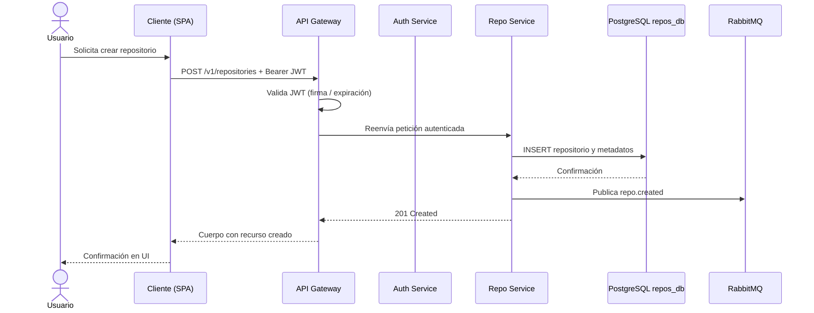
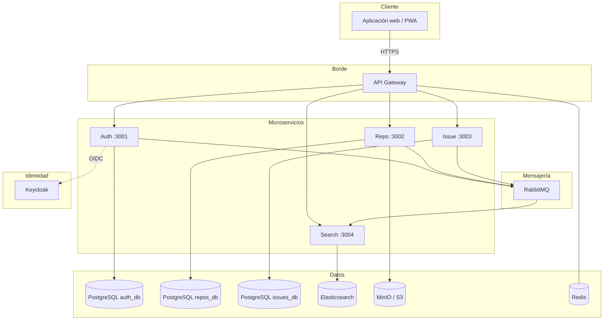
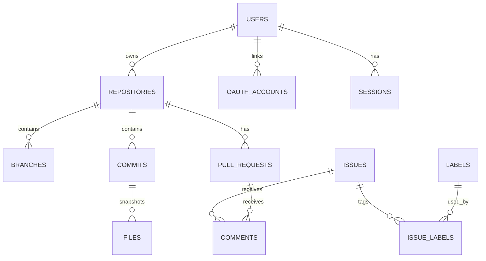
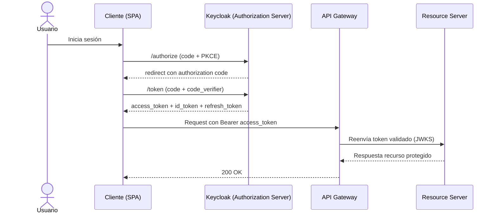

# Mini-GitHub — Documento de diseño técnico

**Estado del documento:** EN REVISIÓN

---

## Resumen

Mini-GitHub es un proyecto académico que implementa una forja de código simplificada con arquitectura de microservicios. El sistema permite autenticación (local y OIDC con Keycloak), gestión de repositorios, operaciones Git básicas por HTTPS (sin SSH), issues, pull requests en flujo básico y búsqueda. La solución se documenta a partir de un contrato API en Smithy/OpenAPI y se despliega en entorno cloud/local con PostgreSQL por servicio, almacenamiento de objetos y mensajería asíncrona.

Nuestros clientes son principalmente estudiantes, docentes y evaluadores que usan la demo para validar capacidades técnicas del equipo. El valor que entregamos es una plataforma entendible, desplegable y demostrable en tiempos académicos, con foco en seguridad básica, trazabilidad y alcance realista (sin funcionalidades enterprise como CI/CD integrado, notificaciones y reglas avanzadas de protección de ramas).

---

## Supuestos

1. Se asume la disponibilidad de un proveedor **cloud** (p. ej. AWS) con permisos suficientes para desplegar EKS, RDS y recursos de red asociados, o bien un entorno local equivalente (p. ej. Docker Compose) para desarrollo.
2. Se asume que **Keycloak** queda operativo —ya sea mediante el stack CDK de referencia o un despliegue equivalente— con _realm_ y clientes configurados para el flujo OIDC descrito en este documento.
3. Se asume que el equipo dispone del repositorio **Github-Smithy** compilable (`./gradlew build`, `./gradlew smithyBuild`) para obtener el artefacto OpenAPI canónico.
4. Se asume que el proyecto se desarrollará en un plazo máximo de **4 semanas**.
5. Se asume un equipo de hasta **4 integrantes** con disponibilidad suficiente para sostener el marco de trabajo ágil acordado.

---

## Alcance y fases

La Fase 1 incluye:

- Diseño técnico del sistema y definición de arquitectura de microservicios.
- Configuración de autenticación y autorización (AuthN/AuthZ) con Keycloak y OIDC.
- Definición y validación del contrato API en Smithy/OpenAPI.
- Base de infraestructura para entorno de desarrollo y despliegue inicial.

La Fase 2 incluye:

- Implementación de microservicios principales (Auth, Repo, Issue, Search).
- Persistencia en PostgreSQL por servicio, almacenamiento de archivos y mensajería asíncrona.
- Funcionalidades de producto: repositorios, archivos, issues, pull requests básicos, búsqueda y colaboración.
- Endpoints documentados en Swagger y validación funcional integrada.

La Entrega final incluye:

- Despliegue funcional en cloud y validación operativa.
- Observabilidad básica (health checks y logging).
- Evidencia de automatización externa del proyecto del equipo (sin CI/CD como feature del producto).
- Presentación final y demo grabada.

Fuera del alcance:

- CI/CD como funcionalidad del producto Mini-GitHub (L-01).
- Funcionalidades enterprise del servidor Git (HA/replicación/hardening avanzado).
- Acceso por SSH y gestión de claves públicas (solo HTTPS para operaciones Git).
- Organizaciones complejas y permisos empresariales avanzados.
- Registro de paquetes, Git LFS y búsqueda full-text dentro del contenido de archivos.
- Notificaciones por correo o en tiempo real (WebSockets/SSE/push).

---

## 1. Requerimientos

### 1.1 Requerimientos Funcionales

1. **RF-P1 (Alta).** Los usuarios registrados deben poder **autenticarse** mediante correo y contraseña o, alternativamente, mediante **OIDC/SSO** con Keycloak (incluida federación con proveedores externos configurados en el _realm_), **para** acceder a recursos protegidos sin depender de un único mecanismo de credenciales.

2. **RF-P2 (Alta).** Los usuarios autenticados deben poder **crear y administrar repositorios** (visibilidad pública o privada), **subir y recuperar archivos** asociados y consultar la estructura lógica de ramas según el modelo académico, **para** versionar y compartir artefactos de software dentro de los límites del proyecto.

3. **RF-P3 (Media).** Los colaboradores autorizados deben poder **gestionar issues y pull requests en flujo básico** (creación, comentarios, revisión y merge simplificado), **para** coordinar cambios sin implementar el ecosistema completo de revisiones de GitHub.

### 1.2 Requerimientos no funcionales

| ID         | Enunciado                                                                                                                         | Métrica o criterio de verificación                                                                                   | Dimensión                                                     |
| ---------- | --------------------------------------------------------------------------------------------------------------------------------- | -------------------------------------------------------------------------------------------------------------------- | ------------------------------------------------------------- |
| **RNF-P1** | El sistema debe implementar **arquitectura de microservicios** con al menos cuatro servicios desplegables de forma independiente. | Cuatro o más contenedores/servicios con health check operativo en compose o K8s.                                     | Escalabilidad / modularidad                                   |
| **RNF-P2** | El API Gateway debe ofrecer latencia razonable bajo carga académica.                                                              | p95 de latencia en rutas críticas **inferior a 200 ms** en pruebas con ~100 usuarios concurrentes simulados.         | Latencia                                                      |
| **RNF-P3** | Las comunicaciones externas deben emplear **HTTPS (TLS 1.3)** y los secretos no deben almacenarse en código fuente.               | Endpoints públicos solo TLS; variables sensibles inyectadas por entorno o secretos de K8s.                           | Seguridad                                                     |
| **RNF-P4** | Cada microservicio debe persistir en **su propia base PostgreSQL** (patrón _database per service_).                               | Tres instancias lógicas mínimas (`auth_db`, `repos_db`, `issues_db`) sin esquema compartido accidental.              | Consistencia de diseño / CAP (servicios débilmente acoplados) |
| **RNF-P5** | El contrato REST debe permanecer **versionado y generado desde Smithy**, con documentación **OpenAPI/Swagger** accesible.         | Artefacto `MiniGitHubApi.openapi.json` reproducible por build; UI en `/api-docs` o equivalente por servicio/gateway. | Mantenibilidad                                                |

### 1.3 Estimación de capacidad

Para el alcance académico, se adopta el orden de magnitud ya consensuado en la documentación general: aproximadamente **100 usuarios concurrentes**, almacenamiento total del orden de **gigabytes** en tier gratuito o de demostración, y tráfico de búsqueda dominado por lecturas. Por tanto, no se justifica particionamiento agresivo en la fase inicial; no obstante, el Search Service y Elasticsearch permiten evolucionar hacia mayor volumen si el proyecto lo requiere.

---

## 2. Entidades principales

El modelo conceptual se alinea con `EntidadesPrincipales.md` y el esquema relacional consolidado en `ModeloDeDatos.md`. A continuación se sintetizan los agregados más relevantes y su pertenencia por servicio.

| Entidad (agregado)                                                                   | Servicio propietario | Persistencia                                  | Relación destacada                                                |
| ------------------------------------------------------------------------------------ | -------------------- | --------------------------------------------- | ----------------------------------------------------------------- |
| **User**, **OAuthAccount**, **Session**                                              | Auth                 | PostgreSQL `auth_db`                          | Un usuario posee cero o más cuentas OAuth                         |
| **Repository**, **RepositoryPermission**, **Branch**, **Commit**, **File**, **Star** | Repo                 | PostgreSQL `repos_db` (+ objetos en MinIO/S3) | Repositorio pertenece a un propietario; permisos N:M usuario–repo |
| **Issue**, **Label**, **IssueLabel**, **Comment**, **PullRequest**                   | Issue                | PostgreSQL `issues_db`                        | Issues y PR vinculados al identificador lógico del repositorio    |
| **Índices de búsqueda** (proyección)                                                 | Search               | Elasticsearch                                 | Materialización eventual a partir de eventos de dominio           |

* Un Usuario puede poseer muchos Repositorios y tener múltiples Sesiones activas.

* Un Repositorio contiene múltiples Branches, Commits, e Issues.

* Los Pull Requests conectan dos Branches para proponer cambios.

* Los Comentarios se centralizan en la discusión de Issues y Pull Requests.

* Las Etiquetas (Labels) se vinculan de forma muchos-a-muchos con las Issues para facilitar la filtración.


En este sentido, la separación por servicio permite evolucionar el esquema de issues sin migrar la base de autenticación, a la vez que impone el uso de **identificadores UUID** compartidos como referencias lógicas entre contextos acotados.

---

## 3. API o Interfaz del Sistema

### 3.1 Protocolo y contrato

Se adopta **REST** sobre JSON con autenticación **Bearer JWT**, conforme al servicio Smithy `com.minigithub#MiniGitHubApi` (`@httpBearerAuth`). El listado de operaciones agregadas en `model/service.smithy` agrupa los casos de uso por puertos lógicos de referencia: **3001** (auth), **3002** (repositorio y archivos), **3003** (issues y pull requests), **3004** (búsqueda).

Convención de versionado: la interfaz pública canónica se publica bajo prefijo **`/v1`**.

### 3.2 Operaciones representativas

Este documento resume solo las operaciones críticas. El inventario completo de endpoints públicos se mantiene en `README.md` (sección **API Endpoints**) y el contrato canónico permanece en Smithy/OpenAPI.

**APIs públicas (REST) prioritarias**

| Operación          | Método y ruta                                               | Entrada (request)                                | Salida (response)                          | Excepciones HTTP                         | Restricciones clave                                             |
| ------------------ | ----------------------------------------------------------- | ------------------------------------------------ | ------------------------------------------ | ---------------------------------------- | --------------------------------------------------------------- |
| Register           | `POST /v1/users`                                            | `username`, `email`, `password` (requeridos)     | `user`, `accessToken`, `refreshToken`      | `400`, `409`, `422`                      | `email` válido; contraseña con política mínima                  |
| Login              | `POST /v1/sessions`                                         | `email`, `password` (requeridos)                 | `accessToken`, `refreshToken`, `expiresIn` | `400`, `401`, `429`                      | bloqueo temporal por intentos fallidos                          |
| CreateRepository   | `POST /v1/repositories`                                     | `name` (requerido), `description?`, `visibility` | metadatos del repositorio creado           | `400`, `401`, `403`, `409`               | `name` único por propietario; `visibility` en {public, private} |
| GetFileContent     | `GET /v1/repositories/{owner}/{repo}/contents/{path}`       | `owner`, `repo`, `path` (ruta); `ref?` (query)   | contenido, `sha`, metadatos                | `400`, `401`, `403`, `404`               | `path` obligatorio y normalizado                                |
| CreateIssue        | `POST /v1/repositories/{owner}/{repo}/issues`               | `title` (requerido), `body?`, `labels?`          | issue creado con `id` y `number`           | `400`, `401`, `403`, `404`, `422`        | `title` no vacío; labels válidos en el repo                     |
| CreatePullRequest  | `POST /v1/repositories/{owner}/{repo}/pull-requests`        | `title`, `base`, `head` (requeridos), `body?`    | PR creado (`id`, `status`)                 | `400`, `401`, `403`, `404`, `409`        | no se permite PR si `base == head`                              |
| MergePullRequest   | `POST /v1/repositories/{owner}/{repo}/pull-requests/{prId}/merges` | `prId` (ruta), `commitMessage?`            | estado final de PR (`merged`)              | `400`, `401`, `403`, `404`, `409`, `422` | solo PR abierto y mergeable                                     |
| SearchRepositories | `GET /v1/search/repositories?q={texto}`                     | `q` (requerido), `page?`, `limit?`               | lista paginada de repositorios             | `400`, `401`, `422`                      | `limit` acotado (p. ej. max 100)                                |

**Tipos de datos complejos**

- `Repository`: `id`, `owner`, `name`, `visibility`, `defaultBranch`, `createdAt`.
- `Issue`: `id`, `number`, `title`, `body`, `state`, `labels[]`, `authorId`.
- `PullRequest`: `id`, `title`, `base`, `head`, `status`, `authorId`, `mergedAt?`.

### 3.3 APIs internas y eventos

Las APIs internas son asíncronas mediante eventos en **RabbitMQ**, para desacoplar escritura transaccional e indexación/búsqueda.

| Evento interno  | Productor     | Consumidor principal       | Payload mínimo                                        |
| --------------- | ------------- | -------------------------- | ----------------------------------------------------- |
| `repo.created`  | Repo Service  | Search Service             | `repoId`, `owner`, `name`, `visibility`, `timestamp`  |
| `repo.updated`  | Repo Service  | Search Service             | `repoId`, campos modificados, `timestamp`             |
| `issue.created` | Issue Service | Search Service             | `issueId`, `repoId`, `title`, `authorId`, `timestamp` |
| `pr.merged`     | Issue Service | Search Service / Analytics | `prId`, `repoId`, `mergedBy`, `timestamp`             |

Regla de consistencia: estas proyecciones son eventualmente consistentes; el estado fuente de verdad permanece en las bases transaccionales de cada servicio.

### 3.4 Validación y seguridad de entrada

Las entradas se validan en el borde (gateway/controlador) contra el esquema derivado del contrato, con controles explícitos de seguridad:

- El usuario autenticado se deriva siempre del token Bearer (`sub`); no se acepta `userId` de confianza en el body para autorización.
- Validación de tipos, longitudes y formato para todos los campos requeridos y opcionales.
- Normalización de rutas (`path`) y rechazo de traversal (`..`) para operaciones de archivos.
- Sanitización/escape de cadenas mostrables en UI para reducir XSS persistente o reflejado.
- Parametrización de consultas y prohibición de SQL dinámico concatenado para prevenir inyección SQL.
- Códigos de error consistentes (`400`, `401`, `403`, `404`, `409`, `422`) y cuerpo de error uniforme (`code`, `message`, `details?`).

### 3.5 Ejemplos de contrato

**Ejemplo A - API pública (REST): crear repositorio**

Operación: `CreateRepository`

```http
POST /v1/repositories
Authorization: Bearer <access_token>
Content-Type: application/json

{
    "name": "mini-github-demo",
    "description": "Repositorio de prueba",
    "visibility": "private"
}
```

Respuesta exitosa (`201 Created`):

```json
{
  "id": "a3f4d2c1-8a0e-4d12-a5cc-5f66b8d28b90",
  "owner": "jdoe",
  "name": "mini-github-demo",
  "visibility": "private",
  "defaultBranch": "main",
  "createdAt": "2026-04-05T10:30:00Z"
}
```

Errores y códigos:

- `400 Bad Request`: payload inválido (tipo/formato incorrecto).
- `401 Unauthorized`: token ausente, expirado o inválido.
- `409 Conflict`: nombre de repositorio duplicado para el propietario.
- `422 Unprocessable Entity`: regla de negocio incumplida.

Restricciones:

- Requeridos: `name`, `visibility`.
- Opcional: `description`.
- `owner` y `authorId` no se reciben en body; se derivan del token (`sub`).
- `name` solo acepta caracteres permitidos por política (sin `;`, sin control chars).

**Ejemplo B - API pública (REST): crear pull request**

Operación: `CreatePullRequest`

```http
POST /v1/repositories/{owner}/{repo}/pull-requests
Authorization: Bearer <access_token>
Content-Type: application/json

{
    "title": "Feature auth improvements",
    "base": "main",
    "head": "feature/auth-improvements",
    "body": "Resumen de cambios"
}
```

Respuesta exitosa (`201 Created`):

```json
{
  "id": "7f90f8c1-b8d7-4ebc-98c9-3c3ea1dd04cc",
  "number": 12,
  "status": "open",
  "base": "main",
  "head": "feature/auth-improvements",
  "authorId": "f94a66d0-6b66-4a1f-8f2e-c8d2c64a2605"
}
```

Errores y códigos:

- `400 Bad Request`: campos requeridos faltantes.
- `403 Forbidden`: sin permisos de escritura en el repositorio.
- `404 Not Found`: repositorio o rama inexistente.
- `409 Conflict`: `base` y `head` iguales o PR ya existente para el mismo par.

Tipos de datos complejos involucrados:

- `PullRequest`: `id`, `number`, `status`, `base`, `head`, `authorId`, `mergedAt?`.
- `ApiError`: `code`, `message`, `details?`, `traceId`.

**Ejemplo C - API interna (evento): indexación de búsqueda**

Operación interna: publicación de evento `repo.created` (RabbitMQ)

```json
{
  "event": "repo.created",
  "repoId": "a3f4d2c1-8a0e-4d12-a5cc-5f66b8d28b90",
  "owner": "jdoe",
  "name": "mini-github-demo",
  "visibility": "private",
  "timestamp": "2026-04-05T10:30:01Z"
}
```

Resultado esperado: Search Service consume el evento y actualiza proyección en Elasticsearch (consistencia eventual).

---

## 4. Flujo de datos

El diagrama siguiente resume el camino desde el cliente hasta la persistencia y la emisión de evento.



### 4.2 Flujo de indexación

Cuando el Search Service consume `repo.created`, actualiza el índice en Elasticsearch. Por tanto, la consistencia entre lectura en búsqueda y escritura en Repo es **eventual**, coherente con un patrón CQRS ligero.

---

## 5. Diseño de alto nivel

### 5.1 Componentes y comunicaciones



Este diagrama resume la topología documentada en `README.md` de github-docs. Además, conecta el rol de **Keycloak** como proveedor OIDC externo a los microservicios.

### 5.2 Infraestructura AWS (referencia Github-Cdk)

El stack `KeycloakStack` compone **GithubVpc**, **KubeCluster** (EKS), **GithubDatabase** (RDS PostgreSQL) y **KeycloakManifests**. En consecuencia, la identidad del despliegue académico puede anclarse a un entorno Kubernetes gestionado en AWS, si bien los microservicios de negocio pueden desplegarse en fases posteriores sobre el mismo clúster o en compose local.

---

## 6. Inmersiones profundas

### 6.1 Esquema de base de datos

**Tabla simple de entidades críticas**

| Tabla | Columna | Tipo | Restricciones | Descripción |
| --- | --- | --- | --- | --- |
| `repositories` | `id` | UUID | PK, NOT NULL | Identificador único del repositorio |
| `repositories` | `owner_id` | UUID | FK NOT NULL -> `users.id` | Propietario del repositorio |
| `issues` | `repo_id` | UUID | NOT NULL, índice | Referencia lógica a repositorio (validada en aplicación) |
| `issues` | `number` | INTEGER | UNIQUE (`repo_id`, `number`) | Numeración secuencial por repositorio |
| `pull_requests` | `status` | VARCHAR(20) | CHECK (`open`,`closed`,`merged`) | Estado del PR |
| `comments` | `issue_id` / `pull_request_id` | UUID | CHECK de exclusión mutua | Objetivo del comentario |

**Fuente de diagrama ER (Mermaid)**



### 6.2 Escalabilidad e infraestructura

El diseño se apoya en servicios stateless detrás de API Gateway, con escalado horizontal en capa de aplicación y escalado vertical controlado en datos.

**Estrategia de escalado**

- Escalado horizontal: API Gateway, Auth, Repo, Issue y Search con réplicas según carga (RNF11).
- Escalado vertical inicial: PostgreSQL por servicio (`db.t3.micro` en referencia académica) con posibilidad de subir clase de instancia antes de particionar.
- Escalado por desacople: RabbitMQ absorbe picos y permite que indexación en Search no bloquee transacciones críticas.

**Cuellos de botella y mitigaciones**

- Base de datos: riesgo en picos de escritura. Mitigación: índices en columnas de filtro frecuentes, pooling y paginación obligatoria.
- Búsqueda: latencia por reindexado. Mitigación: consumo asíncrono por lotes y control de `limit` en API de búsqueda.
- Almacenamiento de objetos: latencia en archivos grandes. Mitigación: límites de tamaño y flujo por streaming.

**Capacidad objetivo (alineada con docs)**

- Concurrencia mínima objetivo: **100 usuarios concurrentes**.
- Objetivo de latencia gateway: p95 < **100-200 ms** según entorno de prueba (RNF10 y ajuste académico de esta entrega).
- Patrón de tráfico esperado: predominio de lecturas (búsqueda y consultas de repositorio) sobre escrituras.

**Estimación de costo mensual (orden de magnitud, 1 región x 1 etapa)**

```text
Total = sumaDeTodosLosServicios * paresDeRegionEtapa
```

- EKS (control plane): ~USD 70/mes
- Nodos de cómputo (2 instancias medianas): ~USD 60/mes
- PostgreSQL (3 instancias pequeñas): ~USD 45/mes
- Elasticsearch/OpenSearch (nivel básico): ~USD 35/mes
- Object storage (50 GB): ~USD 1-2/mes
- Tráfico y extras operativos: ~USD 10-20/mes

**Total estimado:** ~USD 220-230/mes (orden de magnitud para demo cloud). En Docker Compose local, el costo cloud puede reducirse casi a cero para desarrollo.

**Flujo de tráfico de red esperado (aprox.)**

Supuesto: 50 QPS promedio y 30 KB por solicitud-respuesta agregada.

```text
50 req/s * 30 KB = 1.5 MB/s
1.5 MB/s * 60 = 90 MB/min
90 MB/min * 60 = 5.4 GB/h
5.4 GB/h * 24 = 129.6 GB/día
```

Limitaciones aceptadas para esta fase: sin multi-región, sin autoscaling avanzado por métrica de negocio y sin HA enterprise del servidor Git.

### 6.3 Métricas y Monitoreo

Se define monitoreo operativo mínimo alineado con RNF (latencia, disponibilidad, salud y seguridad), con alarmas accionables.

| Sistema | Métrica | Umbral de Alarma | Responsable | Enlace | Descripción |
| --- | --- | --- | --- | --- | --- |
| API Gateway | Latencia p95 | > 200 ms sostenido 5 min | Equipo Backend | TBD | Control de SLO de rutas críticas |
| API Gateway | Error rate (5xx) | > 2% por 5 min | Equipo Backend | TBD | Detecta degradación de servicios aguas abajo |
| Auth Service | Fallas de login | > 10% por 10 min | Equipo Auth | TBD | Detecta caída de IdP, credenciales inválidas masivas o abuso |
| Repo/Issue/Search | Health check `/health` | 2 fallas consecutivas | Equipo Plataforma | TBD | Disponibilidad de cada microservicio |
| RabbitMQ | Cola acumulada | > 1000 mensajes pendientes | Equipo Plataforma | TBD | Riesgo de atraso en indexación/eventos |
| PostgreSQL | Uso de CPU | > 80% por 10 min | Equipo Datos | TBD | Señal de cuello de botella en BD |

Respuesta operativa:

- Alarma crítica abre incidente y notifica canal del equipo.
- Se ejecuta SOP de diagnóstico (API, DB, mensajería, IdP).
- Se registra causa raíz y acción correctiva.

### 6.4 Seguridad

Controles de seguridad aplicados para la fase actual:

- Autenticación centralizada con Keycloak (OIDC) y tokens Bearer JWT.
- Comunicación externa obligatoria por HTTPS (TLS 1.3).
- RBAC por repositorio (Owner, Developer, Reporter) para autorización de operaciones.
- Derivación de identidad desde `sub` del token; no se confía en `userId` del body.
- Validación de entrada (tipos, longitudes, formatos), sanitización de salida y consultas parametrizadas.
- Contraseñas hasheadas (bcrypt) y secretos fuera del código (variables de entorno/secret manager).

Riesgos y mitigaciones prioritarias:

- Inyección SQL/XSS: validación estricta + escape/sanitización + ORM/query parametrizada.
- Abuso de login: rate limit y bloqueo temporal por intentos fallidos.
- Exposición de paneles administrativos: restringir Keycloak Admin API a red interna.


#### 6.4.1 Flujo de autenticación OIDC (AuthN)

Flujo adoptado: **Authorization Code Flow con PKCE** (cliente público SPA + backend API).

Justificación:

- Evita exponer secretos de cliente en frontend.
- Es el flujo recomendado para aplicaciones web modernas con OIDC.



Claims esperados en tokens:

| Token | Claims relevantes |
| --- | --- |
| `id_token` | `sub`, `email`, `preferred_username`, `name`, `iat`, `exp` |
| `access_token` | `sub`, `scope`, `roles`, `aud`, `iat`, `exp`, `iss` |

#### 6.4.2 Modelo de autorización (AuthZ)

Modelo: **RBAC por repositorio** con soporte por scopes OAuth2.

| Rol | Lectura repositorio | Escritura archivos | Gestión issues | Gestión PR | Administración repo |
| --- | --- | --- | --- | --- | --- |
| Owner | Si | Si | Si | Si | Si |
| Developer | Si | Si | Si | Si | No |
| Reporter | Si | No | Parcial | Comentarios | No |

Mapeo de scopes a operaciones API:

| Scope | Operaciones principales |
| --- | --- |
| `repos:read` | `GET /v1/repositories/*`, `GET /v1/search/repositories` |
| `repos:write` | `POST/PATCH/DELETE /v1/repositories/*` |
| `issues:write` | `POST/PATCH /v1/repositories/{owner}/{repo}/issues` |
| `pulls:write` | `POST /v1/repositories/{owner}/{repo}/pull-requests` y `.../merges` |

#### 6.4.3 Integración SSO y ciclo de tokens

- Header de autorización: `Authorization: Bearer <access_token>`.
- Expiración objetivo: `access_token` 15 minutos; `refresh_token` 7 días.
- Renovación: refresh token rotatorio; revocación en logout y ante sospecha de compromiso.
- Secretos: solo por variables de entorno/secret manager, nunca hardcoded.
- Regla de seguridad: identidad de usuario derivada de `sub` del token, no de campos en body.

### 6.5 Extensibilidad

El diseño favorece extensibilidad por separación de dominios, contrato explícito de API y eventos de dominio.

Evoluciones previstas:

- Escenario x10: aumentar réplicas de servicios stateless, workers de búsqueda y recursos de BD.
- Escenario x100: particionamiento de índices de búsqueda, caching más agresivo y posible separación adicional de servicios de lectura.
- Versionado de API: mantener `/v1`, introducir `/v2` cuando haya cambios incompatibles y deprecar con ventana definida.
- Datos: migraciones `expand/contract` para minimizar riesgo de ruptura.

No objetivos explícitos en esta fase:

- Funciones enterprise completas de Git host (HA multi-región, hardening avanzado, reglas complejas de protección de ramas).
- CI/CD como feature del producto.

### 6.6 Arquitectura a Mayor Escala

A mayor escala, se mantiene la separación de límites por dominio para evitar acoplamiento accidental:

- Auth: identidad, sesiones y federación OIDC.
- Repo: repositorios, ramas, commits, archivos y colaboración.
- Issue: issues, labels, comentarios y PR básicos.
- Search: proyecciones de lectura eventual e indexación.

Decisiones de partición funcional:

- Mantener Search separado por perfil de carga y modelo de consistencia eventual.
- Mantener Issue separado de Repo para evolución independiente de flujos de trabajo.
- Evitar FK cross-service: integración por UUID lógico y validación en capa de aplicación.

### 6.7 Proceso de Lanzamiento

El lanzamiento se plantea por etapas, coherente con el alcance académico y L-01:

1. Validación local en Docker Compose.
2. Despliegue de identidad (Keycloak y base asociada).
3. Despliegue de API Gateway y microservicios de negocio.
4. Verificación de salud, smoke tests y revisión de endpoints críticos.
5. Activación para demo/docencia.

Rollback operativo:

- Rollback por servicio usando imagen estable previa.
- Si falla un servicio no crítico (p. ej. Search), mantener operación degradada documentada.
- Cambios de esquema solo con migraciones reversibles o plan de contingencia.


### 6.8 Despliegues Regionales

Estrategia regional para la fase actual:

- Región primaria única para cloud demo (p. ej. `us-east-1`), más entorno local para desarrollo.
- Stages previstos: `dev` (local/cloud) y `demo`.
- No se habilitan despliegues multi-regionales en esta fase ni en el alcance actual del proyecto.

Compatibilidad de servicios:

- Si la región seleccionada no ofrece un componente gestionado requerido, usar alternativa equivalente dentro de la misma región o en entorno local para demo.


### 6.9 Retención de Datos

Política propuesta de retención:

- Datos transaccionales (PostgreSQL): retención durante el ciclo del curso + respaldo periódico.
- Objetos/archivos (MinIO/S3): retención activa mientras el repositorio exista.
- Logs operativos: 30-90 días según costo disponible.
- Índices de búsqueda: recreables desde eventos/datos fuente; retención orientada a rendimiento.

Gestión de eliminación:

- Borrado lógico cuando aplique para trazabilidad de demo.
- Borrado físico programado en cleanup final de ambiente.

Política de backups (AWS):

- PostgreSQL (RDS): backups automáticos diarios + snapshots, con retención de 7 días en `dev` y 30 días en `demo`.
- Logs y artefactos operativos: retención de 30 días por defecto en almacenamiento de logs.
- Objetos (S3/MinIO compatible): versionado habilitado en bucket de demo y lifecycle para limpieza de versiones antiguas.
- Prueba de restauración: al menos una restauración validada por iteración académica.

Estimación de crecimiento:

- Inicio: 20-50 GB en objetos + 10-20 GB en metadatos.
- Crecimiento esperado: lineal por actividad de cargas y forks.

### 6.10 Metodología de Pruebas

Estrategia de pruebas por capas:

- Unitarias: lógica de negocio, validadores y políticas RBAC.
- Integración: API + base por servicio, mensajería y almacenamiento de objetos.
- Contrato: validación de endpoints respecto a Smithy/OpenAPI.
- End-to-end básico: login, creación de repo, issue y PR básico.
- Carga: prueba con al menos 100 usuarios concurrentes para validar latencia/error rate.

Dependencias para pruebas:

- Contenedores de PostgreSQL, RabbitMQ, Redis, MinIO/S3 compatible.
- Keycloak de pruebas con realm dedicado.

Criterios mínimos de salida:

- 0 fallos críticos en smoke tests.
- p95 dentro de objetivo acordado para rutas críticas.
- No regresiones en autenticación y autorización.


### 6.11 Dependencias

Dependencias externas al código de negocio del equipo:

- Keycloak (IdP OIDC) para autenticación/federación.
- Proveedor cloud (AWS o equivalente) para cómputo, red y bases gestionadas.
- RabbitMQ/Redis/Elasticsearch como componentes de plataforma.
- Repositorio de contrato (`Github-Smithy`) para artefacto OpenAPI canónico.

### 6.12 Operaciones

Operación diaria esperada (fase demo):

- Verificar estado de servicios (`/health`) y conectividad con dependencias.
- Revisar colas de RabbitMQ y latencia del gateway.
- Rotar/revocar credenciales según política del entorno.
- Ejecutar backup y prueba de restauración mínima planificada.

Runbooks mínimos recomendados:

- Incidente de autenticación (fallo de login/OIDC).
- Caída de base de datos de un servicio.
- Atraso de cola de eventos y desincronización de búsqueda.
- Degradación de latencia en API Gateway.

Punto de entrada operativo:

- Dashboard unificado con: disponibilidad por servicio, latencia p95, error rate, backlog de colas y uso de DB.

---

## Temas de discusión

### Decisión TD-1: fuente de verdad del contrato API

**Contexto:** coexisten descripciones en README y el modelo Smithy.

- **Opción A [RECOMENDADA]:** Smithy como fuente única; generación de OpenAPI en build. _Pros:_ coherencia, diff versionable. _Contras:_ curva de aprendizaje.
- **Opción B:** OpenAPI escrito a mano. _Pros:_ inmediatez. _Contras:_ deriva frente al código.

**Conclusión:** se adopta la **Opción A**, por tanto las implementaciones deben validarse contra el artefacto generado.

### Decisión TD-2: despliegue de Keycloak

**Contexto:** coste y complejidad de EKS frente a compose local.

- **Opción A [RECOMENDADA para demo cloud]:** Stack CDK documentado. _Pros:_ alineación con la asignatura. _Contras:_ coste.
- **Opción B:** Solo Docker Compose local. _Pros:_ economía. _Contras:_ menor fidelidad con “cloud”.

**Conclusión:** el diseño admite **ambas**, pero la narrativa académica privilegia la **Opción A** como referencia arquitectónica.

---

## Interesados

- Cuerpo docente de la asignatura (evaluación de Parte 1).
- Integrantes del equipo desarrollador del Mini-GitHub.
- Eventuales revisores de seguridad o infraestructura en la institución.

---

## Contactos

| Rol                       | Nombre        | Contacto      |
| ------------------------- | ------------- | ------------- |
| Responsable del documento | _(completar)_ | _(completar)_ |
| Integrantes del equipo    | _(completar)_ | _(completar)_ |

---

## Apéndice A — Artefactos gráficos para exportación

El cuerpo del documento ya incluye diagramas en **Mermaid**. Si la consigna exige **archivos de imagen** (p. ej. para aula virtual o informe PDF), el equipo debe:

1. Crear la carpeta **`docs/semana1/imagenes/`** en el repositorio `github-docs` (si no existe).
2. Renderizar los diagramas mediante [Mermaid Live Editor](https://mermaid.live), **draw.io** (plugin Mermaid) o la extensión de diagramas del IDE.
3. Guardar como mínimo:
    - `diagrama-authn-oidc.png` — secuencia del flujo OIDC (sección 6.4.1).
    - `diagrama-authz-rbac.png` — modelo de autorización (sección 6.4.2).
   - _(opcional)_ `diagrama-componentes.png` — figura de la sección 5.1.
   - _(opcional)_ `diagrama-secuencia-repo.png` — figura de la sección 4.1.

4. Insertar en una futura revisión del documento las referencias Markdown: ``.

_Motivo:_ en este entorno no se generan archivos binarios de imagen automáticamente; por ello, la exportación queda como paso explícito del equipo.

---

## Apéndice B — Actas de revisión

| Fecha         | Asistentes | Acuerdos | Acciones |
| ------------- | ---------- | -------- | -------- |
| _(pendiente)_ |            |          |          |

---

## Referencias cruzadas de repositorios

| Artefacto | Referencia |
| --- | --- |
| Índice oficial de repositorios | `docs/Repositorios.md` |
| Documentación de producto | Repositorio `github-docs` (ver índice) |
| Contrato Smithy | Repositorio `Github-Smithy` (ver índice) |
| Infraestructura AWS | Repositorio `Github-Cdk` (ver índice) |
| Patrón Spring (referencia) | Repositorio `Github-ms-users` (ver índice) |

---
