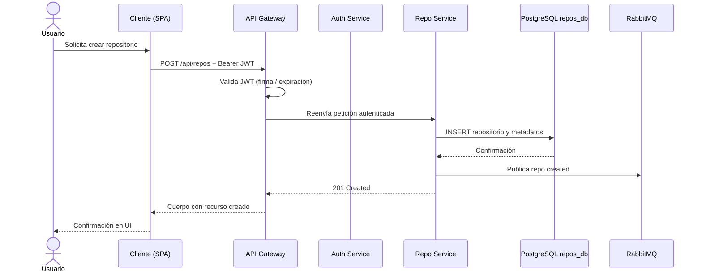
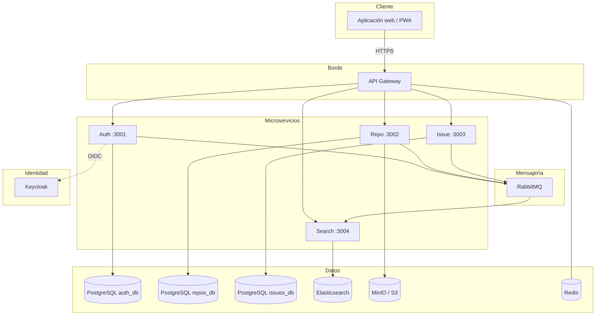
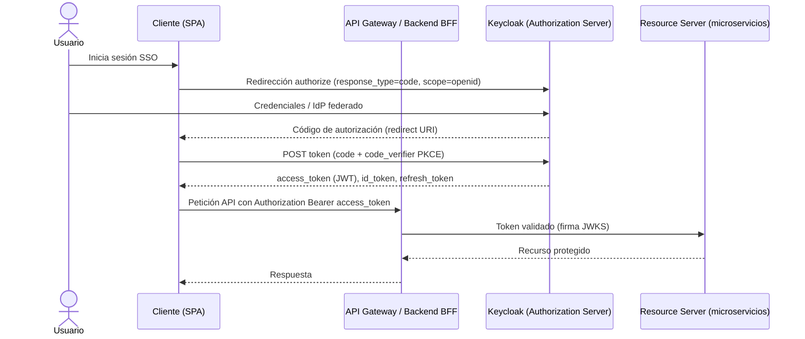
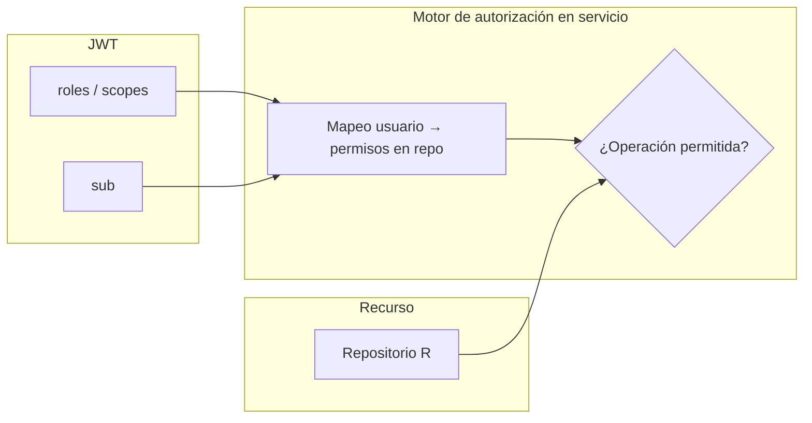

# Mini-GitHub — Documento de diseño técnico (Parte 1)

**Estado del documento:** EN REVISIÓN

**Asignatura:** Arquitectura en la Nube y Microservicios

**Sistema:** Mini-GitHub (plataforma simplificada de control de versiones y colaboración)

**Fuentes normativas del proyecto:** repositorio `github-docs` (`docs/README.md`, `Alcances.md`, `Limites.md`, `RFuncionales.md`, `RNFuncionales.md`, `EntidadesPrincipales.md`, `ModeloDeDatos.md`, `HistoriasDeUsuario.md`); contrato API en `Github-Smithy`; infraestructura de referencia en `Github-Cdk`; patrones de implementación Java de referencia en `Github-ms-users`.

---

## Resumen

El presente documento expone el diseño técnico del ecosistema **Mini-GitHub**, concebido como un proyecto académico que reproduce, de manera deliberadamente acotada, las capacidades esenciales de una forja de código tipo GitHub. En primer lugar, se delimita el problema: se requiere una arquitectura de **microservicios** desplegable en la nube, con **identidad federada** mediante **OpenID Connect (OIDC)** sobre **Keycloak**, persistencia **PostgreSQL** conforme al patrón *database per service*, almacenamiento de objetos para artefactos binarios, indexación para búsqueda y mensajería asíncrona entre servicios. En segundo lugar, se articula la solución en torno a un **contrato de API central** definido en **Smithy 2.0** (`MiniGitHubApi`), del cual se deriva **OpenAPI** para documentación y alineación entre implementaciones.

Asimismo, el diseño reconoce la existencia de un repositorio de **infraestructura como código** basado en **AWS CDK**, el cual provisiona red (VPC), clúster **Amazon EKS**, base **Amazon RDS PostgreSQL** para Keycloak y manifiestos de despliegue de Keycloak en Kubernetes. Por tanto, la narrativa que sigue no se limita al código de aplicación, sino que conecta el modelo lógico de negocio con el aprovisionamiento físico y con las exclusiones explícitas del producto (por ejemplo, ausencia de pipelines CI/CD integrados y de subsistema de notificaciones, según `Limites.md`).

Finalmente, cabe señalar que los usuarios finales del sistema —estudiantes, docentes y evaluadores que operan la demo— constituyen el público implícito del diseño; en consecuencia, las decisiones de latencia, seguridad y trazabilidad se formulan en función de un entorno de demostración con límites de escala conocidos, sin pretender equivalencia con un producto comercial de alta disponibilidad global.

---

## Supuestos

1. Se asume la disponibilidad de un proveedor **cloud** (p. ej. AWS) con permisos suficientes para desplegar EKS, RDS y recursos de red asociados, o bien un entorno local equivalente (p. ej. Docker Compose) para desarrollo.
2. Se asume que **Keycloak** queda operativo —ya sea mediante el stack CDK de referencia o un despliegue equivalente— con *realm* y clientes configurados para el flujo OIDC descrito en este documento.
3. Se asume que cada microservicio de aplicación posee **su propia base PostgreSQL** (`auth_db`, `repos_db`, `issues_db`), coherente con `ModeloDeDatos.md`, salvo decisión documentada en contrario.
4. Se asume que **no** forma parte del alcance funcional del producto la implementación de **CI/CD interno** (L-01), de modo que el despliegue se documenta como proceso manual o externo al código entregable.
5. Se asume que el equipo dispone del repositorio **Github-Smithy** compilable (`./gradlew build`, `./gradlew smithyBuild`) para obtener el artefacto OpenAPI canónico.

---

## Alcance y fases

### Dentro del alcance (visión de producto)

Conforme a `Alcances.md`, el sistema incluye autenticación local y OIDC/SSO vía Keycloak, gestión de repositorios y archivos (sin protocolo Git completo), issues, pull requests en flujo básico, búsqueda por nombre de repositorio y usuario, colaboración con estrellas y roles por repositorio, y **API REST documentada** (Swagger UI). La aclaración sobre pull requests en `Limites.md` confirma que el flujo básico de PR permanece **dentro** del proyecto, mientras que políticas avanzadas tipo GitHub Enterprise quedan excluidas.

### Fuera del alcance

Las exclusiones relevantes —ordenadas según su impacto en el diseño— son: pipelines CI/CD como producto (L-01); acceso SSH (L-02); organizaciones complejas (L-03); registros de paquetes (L-04); Git LFS (L-05); notificaciones en tiempo real o por correo (L-06); búsqueda full-text dentro del contenido de archivos (L-07). En conjunto, dichas exclusiones reducen la superficie de integración y permiten centrar el diseño en autenticación, metadatos de repositorio, issues y contrato API.

### Fases propuestas

| Fase | Contenido principal | Resultado esperado |
| ---- | ------------------- | ------------------ |
| **1** | Autenticación, gateway mínimo, contrato Smithy estable, despliegue Keycloak + RDS (referencia CDK) | Flujo OIDC demostrable; API documentada |
| **2** | Repo Service, almacenamiento de objetos (MinIO/S3), eventos hacia búsqueda | CRUD de repositorios y archivos coherentes con OpenAPI |
| **3** | Issue Service, Search Service, frontend integrado | Flujos HU principales cerrados en demo |
| **4** | Kubernetes en cloud, validación operativa, documentación final | Entrega académica completa sin CI/CD en producto |

---

## 1. Requerimientos

### 1.1 Requerimientos funcionales

Los siguientes requisitos se formulan en la línea indicada por la rúbrica (actor — capacidad — finalidad) y se priorizan como núcleo del valor del Mini-GitHub.

1. **RF-P1 (Alta).** Los usuarios registrados deben poder **autenticarse** mediante correo y contraseña o, alternativamente, mediante **OIDC/SSO** con Keycloak (incluida federación con proveedores externos configurados en el *realm*), **para** acceder a recursos protegidos sin depender de un único mecanismo de credenciales. *Trazabilidad:* RF01 en `RFuncionales.md`; HUs de épica 1 en `HistoriasDeUsuario.md`.

2. **RF-P2 (Alta).** Los usuarios autenticados deben poder **crear y administrar repositorios** (visibilidad pública o privada), **subir y recuperar archivos** asociados y consultar la estructura lógica de ramas según el modelo académico, **para** versionar y compartir artefactos de software dentro de los límites del proyecto. *Trazabilidad:* RF02, RF03; HUs de repositorios y archivos.

3. **RF-P3 (Media).** Los colaboradores autorizados deben poder **gestionar issues y pull requests en flujo básico** (creación, comentarios, revisión y merge simplificado), **para** coordinar cambios sin implementar el ecosistema completo de revisiones de GitHub. *Trazabilidad:* RF04, RF07 y aclaración de PR en `Limites.md`.

### 1.2 Requerimientos no funcionales

| ID | Enunciado | Métrica o criterio de verificación | Dimensión |
| -- | --------- | ----------------------------------- | --------- |
| **RNF-P1** | El sistema debe implementar **arquitectura de microservicios** con al menos cuatro servicios desplegables de forma independiente. | Cuatro o más contenedores/servicios con health check operativo en compose o K8s. | Escalabilidad / modularidad |
| **RNF-P2** | El API Gateway debe ofrecer latencia razonable bajo carga académica. | p95 de latencia en rutas críticas **inferior a 200 ms** en pruebas con ~100 usuarios concurrentes simulados (referencia `README.md` / RNF10). | Latencia |
| **RNF-P3** | Las comunicaciones externas deben emplear **HTTPS (TLS 1.3)** y los secretos no deben almacenarse en código fuente. | Endpoints públicos solo TLS; variables sensibles inyectadas por entorno o secretos de K8s. | Seguridad |
| **RNF-P4** | Cada microservicio debe persistir en **su propia base PostgreSQL** (patrón *database per service*). | Tres instancias lógicas mínimas (`auth_db`, `repos_db`, `issues_db`) sin esquema compartido accidental. | Consistencia de diseño / CAP (servicios débilmente acoplados) |
| **RNF-P5** | El contrato REST debe permanecer **versionado y generado desde Smithy**, con documentación **OpenAPI/Swagger** accesible. | Artefacto `MiniGitHubApi.openapi.json` reproducible por build; UI en `/api-docs` o equivalente por servicio/gateway. | Mantenibilidad |

### 1.3 Estimación de capacidad *(complementaria)*

Para el alcance académico, se adopta el orden de magnitud ya consensuado en la documentación general: aproximadamente **100 usuarios concurrentes**, almacenamiento total del orden de **gigabytes** en tier gratuito o de demostración, y tráfico de búsqueda dominado por lecturas. Por tanto, no se justifica particionamiento agresivo en la fase inicial; no obstante, el Search Service y Elasticsearch permiten evolucionar hacia mayor volumen si el proyecto lo requiere.

---

## 2. Entidades principales

El modelo conceptual se alinea con `EntidadesPrincipales.md` y el esquema relacional consolidado en `ModeloDeDatos.md`. A continuación se sintetizan los agregados más relevantes y su pertenencia por servicio.

| Entidad (agregado) | Servicio propietario | Persistencia | Relación destacada |
| ------------------ | -------------------- | ------------ | ------------------ |
| **User**, **OAuthAccount**, **Session** | Auth | PostgreSQL `auth_db` | Un usuario posee cero o más cuentas OAuth |
| **Repository**, **RepositoryPermission**, **Branch**, **Commit**, **File**, **Star** | Repo | PostgreSQL `repos_db` (+ objetos en MinIO/S3) | Repositorio pertenece a un propietario; permisos N:M usuario–repo |
| **Issue**, **Label**, **IssueLabel**, **Comment**, **PullRequest** | Issue | PostgreSQL `issues_db` | Issues y PR vinculados al identificador lógico del repositorio |
| **Índices de búsqueda** (proyección) | Search | Elasticsearch | Materialización eventual a partir de eventos de dominio |

En este sentido, la separación por servicio permite evolucionar el esquema de issues sin migrar la base de autenticación, a la vez que impone el uso de **identificadores UUID** compartidos como referencias lógicas entre contextos acotados.

---

## 3. API o interfaz del sistema

### 3.1 Protocolo y contrato

Se adopta **REST** sobre JSON con autenticación **Bearer JWT**, conforme al servicio Smithy `com.minigithub#MiniGitHubApi` (`@httpBearerAuth`). El listado de operaciones agregadas en `model/service.smithy` agrupa los casos de uso por puertos lógicos de referencia: **3001** (auth), **3002** (repositorio y archivos), **3003** (issues y pull requests), **3004** (búsqueda).

### 3.2 Operaciones representativas

Sin pretender exhaustividad en este documento —pues el contrato canónico reside en Smithy—, se destacan las siguientes familias:

- **Autenticación y perfil:** `Register`, `Login`, `Logout`, `RefreshToken`, `GetMe`, `UpdateProfile`, `InitiateOAuth`, `OAuthCallback`, recuperación de contraseña.
- **Repositorio y colaboración:** `CreateRepository`, `GetRepository`, gestión de ramas, `ForkRepository`, `StarRepository`, colaboradores.
- **Archivos y commits (modelo académico):** `GetFileContent`, `CreateFile`, `DeleteFile`, listados y diffs según `files.smithy` y `docs/file-management-spec.md` del repositorio Smithy.
- **Issues y PR:** `CreateIssue`, comentarios, labels, `CreatePullRequest`, `MergePullRequest`.
- **Búsqueda:** `SearchRepositories`, `SearchUsers`, `SearchIssues`.

### 3.3 APIs internas y eventos

Los servicios publican eventos de dominio (p. ej. `repo.created`) hacia **RabbitMQ** para desacoplar indexación y otros consumidores. Dicha interfaz asíncrona complementa el REST síncrono expuesto al cliente.

### 3.4 Validación y seguridad de entrada

Las entradas deben validarse en el borde (gateway o controlador) contra el esquema derivado del contrato; asimismo, los identificadores de sujeto deben extraerse del **token** cuando corresponda, evitando confiar en campos manipulables del cuerpo de la petición.

---

## 4. Flujo de datos

### 4.1 Secuencia ilustrativa: creación de repositorio

El diagrama siguiente resume el camino feliz desde el cliente hasta la persistencia y la emisión de evento. *Nota:* si la plataforma de entrega no renderiza Mermaid, el equipo debe exportar este diagrama como **PNG** o **SVG** siguiendo las instrucciones del apéndice gráfico.

### 4.2 Flujo de indexación *(resumen)*

Cuando el Search Service consume `repo.created`, actualiza el índice en Elasticsearch. Por tanto, la consistencia entre lectura en búsqueda y escritura en Repo es **eventual**, coherente con un patrón CQRS ligero.

---

## 5. Diseño de alto nivel

### 5.1 Componentes y comunicaciones

Este diagrama resume la topología documentada en `README.md` de github-docs y en `.claude-context.md`; además, conecta el rol de **Keycloak** como proveedor OIDC externo a los microservicios.

### 5.2 Infraestructura AWS (referencia Github-Cdk)

El stack `KeycloakStack` compone **GithubVpc**, **KubeCluster** (EKS), **GithubDatabase** (RDS PostgreSQL) y **KeycloakManifests**. En consecuencia, la identidad del despliegue académico puede anclarse a un entorno Kubernetes gestionado en AWS, si bien los microservicios de negocio pueden desplegarse en fases posteriores sobre el mismo clúster o en compose local.

---

## 6. Inmersiones profundas

### 6.1 Esquema de base de datos

El detalle tabular y las sentencias **CREATE TABLE** se mantienen en `ModeloDeDatos.md` para evitar duplicación inconsistente. Para esta entrega, basta recordar que los repositorios, ramas, commits y archivos mantienen integridad referencial dentro de `repos_db`, mientras que issues referencian el repositorio mediante **UUID** lógico.

### 6.2 Escalabilidad e infraestructura

El diseño prevé **réplicas** stateless de API y workers de búsqueda; las bases PostgreSQL permanecen como cuellos de botella verticales en la demo, mitigados por tamaños de instancia modestos (`db.t3.micro` en ejemplos CDK). Asimismo, la ausencia de multi-región se documenta como limitación aceptada.

### 6.3 Autenticación OIDC (AuthN)

Se adopta el **flujo de código de autorización** (*Authorization Code Flow*) con PKCE cuando el cliente es público (SPA), por ser el estándar recomendado para aplicaciones que no pueden guardar un *client secret*. El usuario es redirigido a Keycloak; tras autenticarse, el cliente intercambia el código por tokens en el endpoint de token de Keycloak. Los **JWT** emitidos para la API de aplicación contienen claims mínimos (`sub`, `exp`, roles o *scopes* acordados).

#### Diagrama de secuencia AuthN (OIDC)

**Instrucción para entrega gráfica:** si se exige archivo de imagen para la rúbrica, exporte este diagrama a **`docs/semana1/imagenes/diagrama-authn-oidc.png`** (véase apéndice «Artefactos gráficos»).

### 6.4 Autorización (AuthZ): roles, permisos y ámbitos

El modelo de autorización del dominio Mini-GitHub es predominantemente **RBAC a nivel de repositorio**: roles **Owner**, **Developer** y **Reporter**, alineados con `Alcances.md` y con las operaciones de colaboradores en Smithy (`ListCollaborators`, `AddCollaborator`, etc.). Keycloak gestiona la identidad y puede mapear **roles de realm** o **client roles** hacia claims del JWT; los microservicios aplican **políticas de autorización** que relacionan el `sub` del token con `repository_permissions`.

#### Tabla de roles en repositorio

| Rol | Lectura de código / metadatos | Escritura de archivos | Gestión de issues | Administración del repo (visibilidad, eliminación) |
| --- | ---------------------------- | --------------------- | ----------------- | --------------------------------------------------- |
| **Owner** | Sí | Sí | Sí | Sí |
| **Developer** | Sí | Sí | Sí | No (salvo política explícita adicional) |
| **Reporter** | Sí | No | Limitada (p. ej. comentar según implementación) | No |

#### Ámbitos OAuth2 sugeridos (ilustrativos)

| Scope | Uso previsto |
| ----- | ------------ |
| `openid` | Identidad OIDC |
| `profile` | Claims de perfil básico |
| `email` | Correo verificado |
| `repos:read` | Lectura de repositorios y contenidos permitidos |
| `repos:write` | Mutación de archivos y metadatos |
| `issues:write` | Creación y edición de issues |

#### Diagrama conceptual AuthZ

**Instrucción para entrega gráfica:** exportar como **`docs/semana1/imagenes/diagrama-authz-rbac.png`** si se requiere imagen independiente.

### 6.5 Métricas y monitoreo

Se prevé **health check** HTTP por servicio, logs estructurados con identificador de correlación y, en la medida en que el tiempo del proyecto lo permita, métricas compatibles con Prometheus. De este modo, los fallos en la cola de mensajes o en Elasticsearch pueden detectarse antes de afectar la percepción del usuario final.

### 6.6 Seguridad adicional

Además de TLS y hashing de contraseñas (bcrypt), debe evitarse la exposición de **Keycloak Admin API** hacia Internet; únicamente los servicios internos autorizados deberían administrar *realms* en entornos de producción. El repositorio `Github-ms-users` ilustra patrones de **policy enforcer** en Java que pueden servir de referencia, aunque la implementación concreta de Mini-GitHub puede permanecer en Node.js según el equipo.

### 6.7 Proceso de despliegue

Dado **L-01**, el despliegue se describe como conjunto de pasos manuales o scripts locales: síntesis CDK (`cdk deploy`), configuración de `kubectl`, aplicación de manifiestos y despliegue de microservicios. Cualquier pipeline en GitHub Actions del **repositorio del equipo** queda explícitamente fuera del alcance funcional del producto.

### 6.8 Pruebas

Se recomienda pruebas unitarias por servicio, pruebas de integración con bases en contenedor y, cuando exista OpenAPI estable, **pruebas de contrato** o validación de esquema en CI del equipo (no del producto Mini-GitHub).

### 6.9 Dependencias

| Dependencia | Notas |
| ----------- | ----- |
| Keycloak | Authorization Server OIDC |
| RabbitMQ | Bus de eventos |
| Elasticsearch | Búsqueda; posible SPOF en demo — documentar |
| AWS CDK / EKS / RDS | Infraestructura de referencia opcional |

---

## Temas de discusión

### Decisión TD-1: fuente de verdad del contrato API

**Contexto:** coexisten descripciones en README y el modelo Smithy.

- **Opción A [RECOMENDADA]:** Smithy como fuente única; generación de OpenAPI en build. *Pros:* coherencia, diff versionable. *Contras:* curva de aprendizaje.
- **Opción B:** OpenAPI escrito a mano. *Pros:* inmediatez. *Contras:* deriva frente al código.

**Conclusión:** se adopta la **Opción A**, por tanto las implementaciones deben validarse contra el artefacto generado.

### Decisión TD-2: despliegue de Keycloak

**Contexto:** coste y complejidad de EKS frente a compose local.

- **Opción A [RECOMENDADA para demo cloud]:** Stack CDK documentado. *Pros:* alineación con la asignatura. *Contras:* coste.
- **Opción B:** Solo Docker Compose local. *Pros:* economía. *Contras:* menor fidelidad con “cloud”.

**Conclusión:** el diseño admite **ambas**, pero la narrativa académica privilegia la **Opción A** como referencia arquitectónica.

---

## Interesados

- Cuerpo docente de la asignatura (evaluación de Parte 1).
- Integrantes del equipo desarrollador del Mini-GitHub.
- Eventuales revisores de seguridad o infraestructura en la institución.

---

## Contactos

| Rol | Nombre | Contacto |
| --- | ------ | -------- |
| Responsable del documento | *(completar)* | *(completar)* |
| Integrantes del equipo | *(completar)* | *(completar)* |

---

## Apéndice A — Artefactos gráficos para exportación

El cuerpo del documento ya incluye diagramas en **Mermaid**. Si la consigna exige **archivos de imagen** (p. ej. para aula virtual o informe PDF), el equipo debe:

1. Crear la carpeta **`docs/semana1/imagenes/`** en el repositorio `github-docs` (si no existe).
2. Renderizar los diagramas mediante [Mermaid Live Editor](https://mermaid.live), **draw.io** (plugin Mermaid) o la extensión de diagramas del IDE.
3. Guardar como mínimo:
   - `diagrama-authn-oidc.png` — secuencia del flujo OIDC (sección 6.3).
   - `diagrama-authz-rbac.png` — modelo de autorización (sección 6.4).
   - *(opcional)* `diagrama-componentes.png` — figura de la sección 5.1.
   - *(opcional)* `diagrama-secuencia-repo.png` — figura de la sección 4.1.

4. Insertar en una futura revisión del documento las referencias Markdown: ``.

*Motivo:* en este entorno no se generan archivos binarios de imagen automáticamente; por ello, la exportación queda como paso explícito del equipo.

---

## Apéndice B — Actas de revisión

| Fecha | Asistentes | Acuerdos | Acciones |
| ----- | ---------- | -------- | -------- |
| *(pendiente)* | | | |

---

## Referencias cruzadas de repositorios

| Artefacto | Ubicación |
| --------- | --------- |
| Documentación de producto | `github-docs/docs/*.md` |
| Contexto resumido | `github-docs/.claude-context.md` |
| Contrato Smithy | `Github-Smithy/model/` |
| Infraestructura AWS | `Github-Cdk/lib/stacks/keycloak-stack.ts` y constructs |
| Patrón Spring (referencia) | `Github-ms-users/docs/ARCHITECTURE.md` |

---

*Fin del documento de diseño técnico — Parte 1.*
